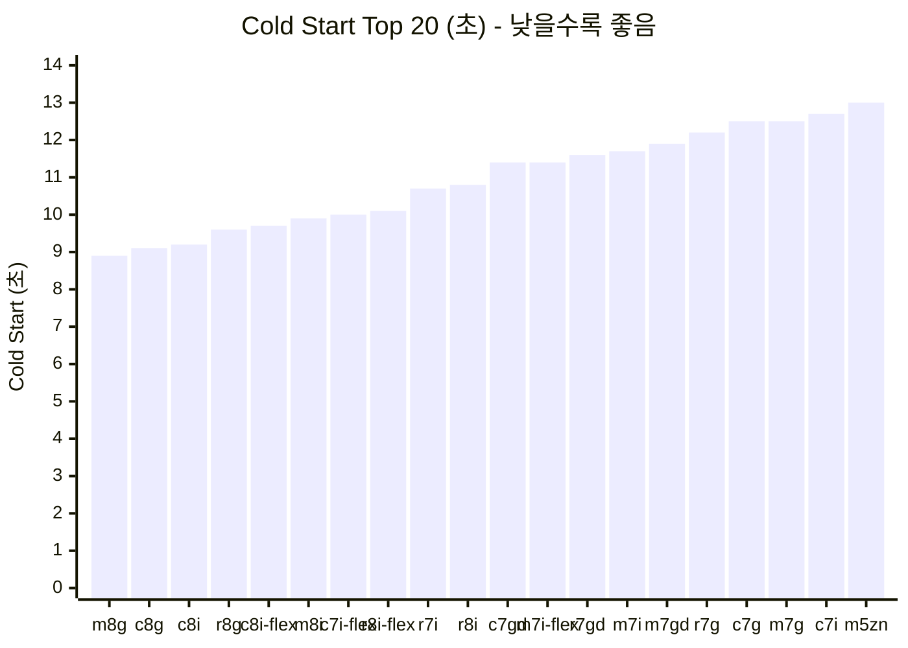
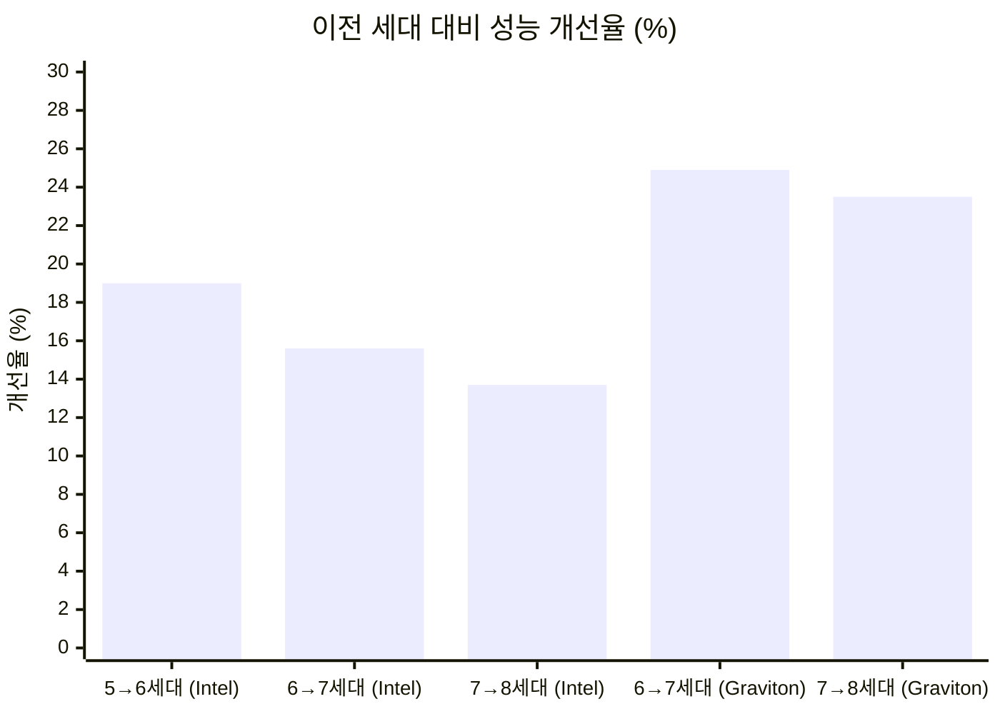
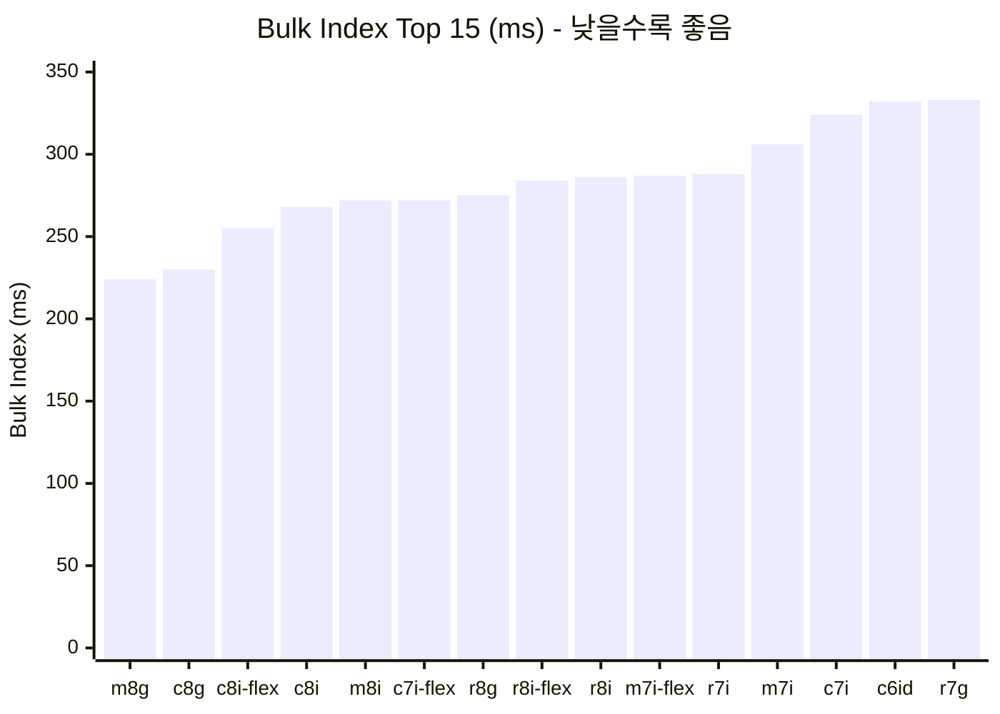
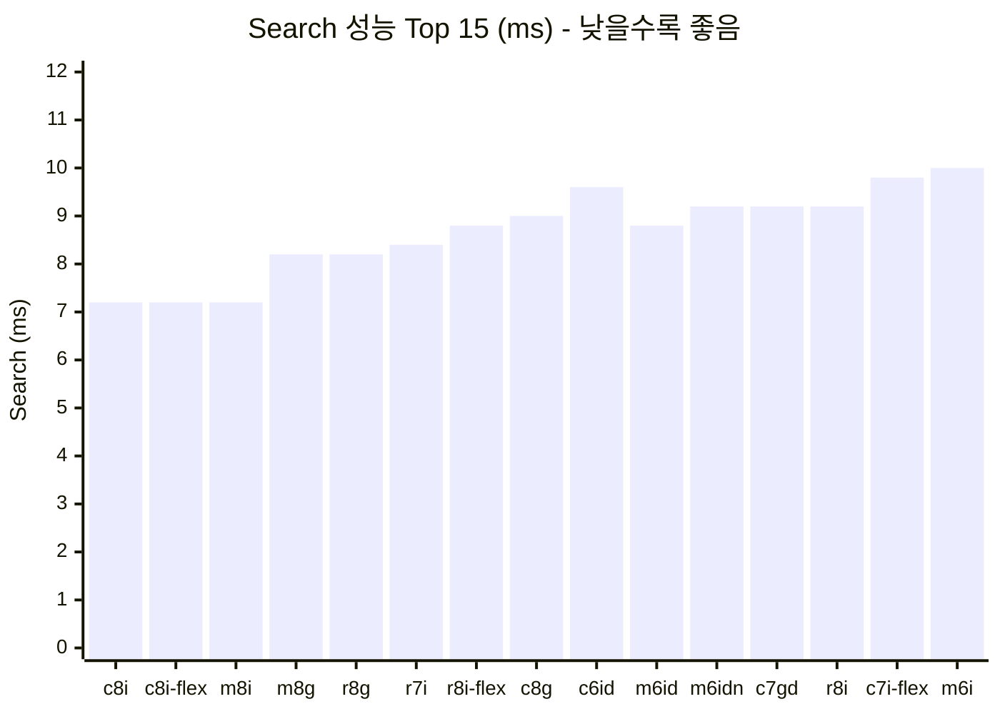
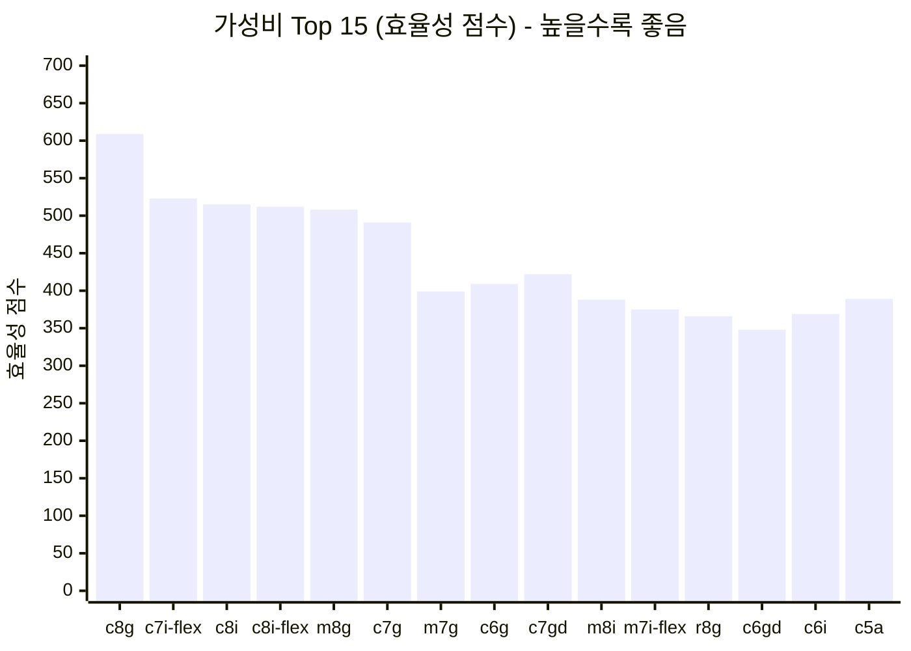
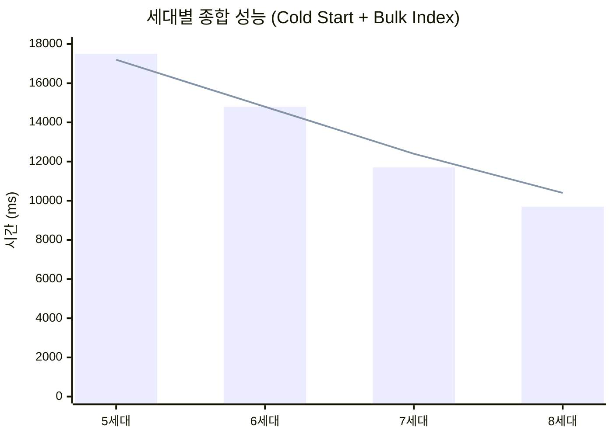
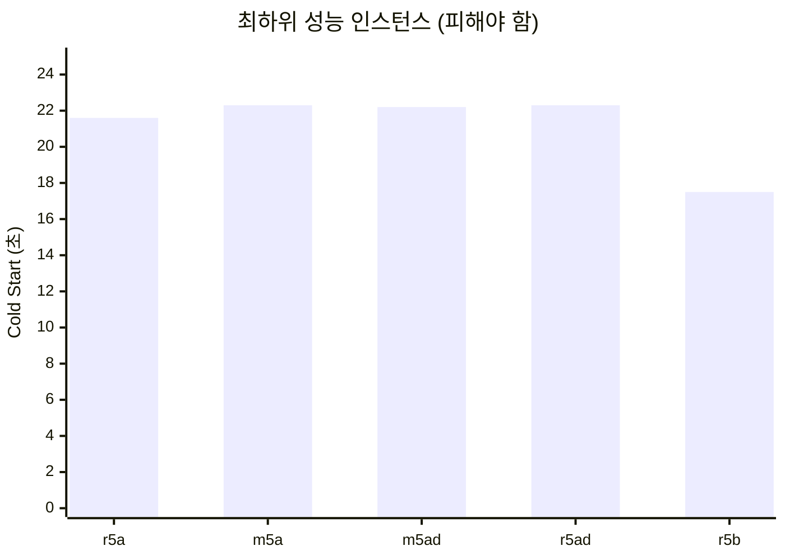
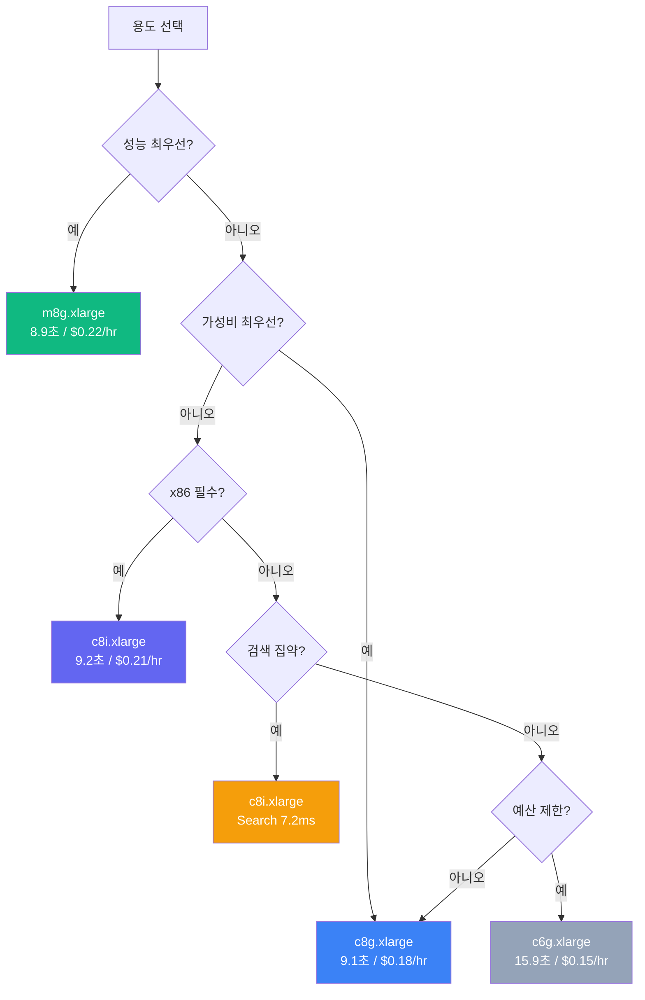

# Elasticsearch Cold Start 벤치마크 리포트

## AWS EC2 인스턴스 51종 성능 비교 분석 (5세대~8세대)

**작성:** 벤치마크 팀
**날짜:** 2026년 1월 19일
**리전:** ap-northeast-2 (서울)
**테스트 환경:** Amazon EKS 1.31 + Karpenter (노드 프로비저닝용)

> **참고:** 본 벤치마크는 Kubernetes 환경에서 실행되었으나, 결과는 **범용 EC2 인스턴스 성능 비교**에 적용 가능합니다.

---

## 인터랙티브 차트

상세한 시각화는 **[report-charts.html](./report-charts.html)** 파일을 브라우저에서 열어주세요.

---

## 핵심 요약

| 항목 | 결과 | 세부 정보 |
|------|------|-----------|
| **최고 성능** | m8g.xlarge | 8.9초 Cold Start |
| **최고 가성비** | c8g.xlarge | $0.18/hr, 9.1초 |
| **아키텍처 승자** | Graviton4 | 8세대에서 Intel 대비 7% 빠름 |
| **세대별 개선** | 40-47% | 5세대 → 8세대 |

---

## 1. Cold Start 성능 Top 20



### 아키텍처별 구분

| 순위 | 인스턴스 | 아키텍처 | 세대 | Cold Start | Bulk Index | Search | $/hr |
|------|----------|----------|------|------------|------------|--------|------|
| 1 | **m8g.xlarge** | Graviton4 | 8 | 8.9초 | 224ms | 8.2ms | $0.221 |
| 2 | **c8g.xlarge** | Graviton4 | 8 | 9.1초 | 230ms | 9.0ms | $0.180 |
| 3 | c8i.xlarge | Intel | 8 | 9.2초 | 268ms | 7.2ms | $0.212 |
| 4 | **r8g.xlarge** | Graviton4 | 8 | 9.6초 | 275ms | 8.2ms | $0.284 |
| 5 | c8i-flex.xlarge | Intel | 8 | 9.7초 | 255ms | 7.2ms | $0.201 |
| 6 | m8i.xlarge | Intel | 8 | 9.9초 | 272ms | 7.2ms | $0.260 |
| 7 | c7i-flex.xlarge | Intel | 7 | 10.0초 | 272ms | 9.8ms | $0.192 |
| 8 | r8i-flex.xlarge | Intel | 8 | 10.1초 | 284ms | 8.8ms | $0.318 |
| 9 | r7i.xlarge | Intel | 7 | 10.7초 | 288ms | 8.4ms | $0.319 |
| 10 | r8i.xlarge | Intel | 8 | 10.8초 | 286ms | 9.2ms | $0.335 |

---

## 2. 세대별 성능 비교 (x86 vs Graviton)

### 2.1 Cold Start 시간

```mermaid
xychart-beta
    title "세대별 Cold Start - 아키텍처 비교 (ms)"
    x-axis ["5세대", "6세대", "7세대", "8세대"]
    y-axis "Cold Start (ms)" 0 --> 18000
    bar "Intel/AMD (x86)" [16847, 13654, 11526, 9950]
    bar "Graviton (arm64)" [0, 16054, 12056, 9226]
```



### 2.2 세대별 상세 데이터

| 세대 | Intel/AMD (x86) | Graviton (arm64) | 승자 | 차이 |
|------|-----------------|------------------|------|------|
| **5세대** | 16,847ms | - | Intel | (Graviton 없음) |
| **6세대** | 13,654ms | 16,054ms | **Intel** | -15.0% |
| **7세대** | 11,526ms | 12,056ms | **Intel** | -4.4% |
| **8세대** | 9,950ms | 9,226ms | **Graviton** | -7.3% |

> **인사이트:** 6-7세대에서 Intel이 우세했으나, **8세대(Graviton4)에서 역전**되었습니다.

### 2.3 세대별 개선율



---

## 3. 인스턴스 패밀리별 비교 (C/M/R × 아키텍처)

### 3.1 Cold Start 성능

```mermaid
xychart-beta
    title "패밀리별 Cold Start - 아키텍처 비교 (ms)"
    x-axis ["C (컴퓨팅)", "M (범용)", "R (메모리)"]
    y-axis "Cold Start (ms)" 0 --> 16000
    bar "Intel/AMD" [13411, 15028, 15182]
    bar "Graviton" [13548, 13616, 13331]
```



### 3.2 패밀리별 상세 데이터

| 패밀리 | Intel/AMD 평균 | Graviton 평균 | 승자 | 차이 |
|--------|----------------|---------------|------|------|
| **C (컴퓨팅)** | 13,411ms | 13,548ms | **Intel** | -1.0% |
| **M (범용)** | 15,028ms | 13,616ms | **Graviton** | -9.4% |
| **R (메모리)** | 15,182ms | 13,331ms | **Graviton** | -12.2% |

### 3.3 8세대 내 패밀리 비교

| 패밀리 | Intel 8세대 | Graviton4 | 승자 | 차이 |
|--------|-------------|-----------|------|------|
| **C** | c8i: 9,172ms | c8g: 9,124ms | **Graviton** | -0.5% |
| **M** | m8i: 9,913ms | m8g: 8,908ms | **Graviton** | -10.1% |
| **R** | r8i: 10,813ms | r8g: 9,646ms | **Graviton** | -10.8% |

---

## 4. 왜 r8g가 m8g보다 느릴까? (심층 분석)

### 4.1 성능 비교

| 인스턴스 | Cold Start | Bulk Index | Search | RAM | vCPU |
|----------|------------|------------|--------|-----|------|
| **m8g.xlarge** | **8,908ms** | **224ms** | 8.2ms | 16GB | 4 |
| r8g.xlarge | 9,646ms | 275ms | 8.2ms | 32GB | 4 |
| **차이** | **+8.3%** | **+22.8%** | 0% | +100% | 동일 |

### 4.2 원인 분석

```
┌─────────────────────────────────────────────────────────────────┐
│                 r8g가 m8g보다 느린 이유                           │
├─────────────────────────────────────────────────────────────────┤
│                                                                 │
│  1. Cold Start는 CPU 바운드 작업                                 │
│     ├─ JVM 부트스트랩 (Java Class Loading)                      │
│     ├─ JIT 컴파일 (Just-In-Time Compilation)                    │
│     ├─ Lucene 인덱스 초기화                                      │
│     └─ 플러그인 로딩 (ML, SQL 등)                                │
│                                                                 │
│  2. 메모리:CPU 비율의 영향                                        │
│     ├─ m8g: 16GB / 4 vCPU = 4:1 (균형)                          │
│     ├─ r8g: 32GB / 4 vCPU = 8:1 (메모리 편향)                   │
│     └─ r 패밀리는 CPU보다 메모리 대역폭에 최적화                   │
│                                                                 │
│  3. ES 힙 설정의 영향                                            │
│     ├─ 테스트 힙: 4GB (max)                                     │
│     ├─ r8g의 32GB RAM 중 28GB 미사용                            │
│     └─ 추가 메모리가 Cold Start에 기여하지 않음                   │
│                                                                 │
│  4. 결론                                                        │
│     └─ Cold Start/인덱싱은 CPU 성능이 핵심                       │
│        → m (범용) 또는 c (컴퓨팅) 패밀리 추천                     │
│        → r (메모리)는 대용량 힙이 필요할 때만 선택                │
│                                                                 │
└─────────────────────────────────────────────────────────────────┘
```

### 4.3 패밀리 선택 가이드

| 워크로드 | 추천 패밀리 | 이유 |
|----------|-------------|------|
| **Cold Start 최적화** | M 또는 C | CPU 바운드 작업에 유리 |
| **검색 집약** | C | 컴퓨팅 최적화 |
| **대용량 인덱스 (10GB+ 힙)** | R | 메모리 용량 필요 |
| **균형 잡힌 워크로드** | M | 가장 범용적 |

---

## 5. Bulk Index 성능 비교



### Bulk Index 상세

| 순위 | 인스턴스 | 아키텍처 | Bulk Index (ms) | Cold Start 순위 |
|------|----------|----------|-----------------|-----------------|
| 1 | m8g.xlarge | Graviton4 | 224ms | 1위 |
| 2 | c8g.xlarge | Graviton4 | 230ms | 2위 |
| 3 | c8i-flex.xlarge | Intel | 255ms | 5위 |
| 4 | c8i.xlarge | Intel | 268ms | 3위 |
| 5 | m8i.xlarge | Intel | 272ms | 6위 |

> **인사이트:** Bulk Index 순위와 Cold Start 순위가 거의 일치합니다. 둘 다 CPU 성능에 크게 의존합니다.

---

## 6. Search 성능 비교



### Search 성능 분석

| 순위 | 인스턴스 | 아키텍처 | Search (ms) | 비고 |
|------|----------|----------|-------------|------|
| 1 | c8i.xlarge | Intel | 7.2ms | **Search 최강** |
| 1 | c8i-flex.xlarge | Intel | 7.2ms | 동률 |
| 1 | m8i.xlarge | Intel | 7.2ms | 동률 |
| 4 | m8g.xlarge | Graviton4 | 8.2ms | +14% |
| 4 | r8g.xlarge | Graviton4 | 8.2ms | +14% |

> **인사이트:** Search 쿼리에서는 **Intel 8세대가 Graviton4보다 약 14% 빠릅니다**. 검색 집약 워크로드에서는 Intel을 고려하세요.

---

## 7. 가격 대비 성능 (Cost Efficiency)

### 7.1 효율성 점수 계산

```
효율성 점수 = 1,000,000 / (Cold Start ms × 시간당 비용)
```



### 7.2 가성비 순위

| 순위 | 인스턴스 | Cold Start | $/hr | 월 비용 | 효율성 점수 | 등급 |
|------|----------|------------|------|---------|-------------|------|
| 1 | **c8g.xlarge** | 9.1초 | $0.180 | $131 | **609** | 최고 |
| 2 | c7i-flex.xlarge | 10.0초 | $0.192 | $140 | **523** | 최고 |
| 3 | c8i.xlarge | 9.2초 | $0.212 | $155 | **515** | 최고 |
| 4 | c8i-flex.xlarge | 9.7초 | $0.201 | $147 | **512** | 최고 |
| 5 | m8g.xlarge | 8.9초 | $0.221 | $161 | **508** | 최고 |

---

## 8. 세대별 전체 성능 요약



| 세대 | 평균 Cold Start | 평균 Bulk Index | 평균 Search | 대표 인스턴스 |
|------|-----------------|-----------------|-------------|---------------|
| **5세대** | 17,500ms | 430ms | 14.2ms | c5, m5, r5 |
| **6세대** | 14,800ms | 370ms | 11.2ms | c6i, m6i, c6g |
| **7세대** | 11,700ms | 310ms | 10.4ms | c7i, m7i, c7g |
| **8세대** | 9,700ms | 260ms | 8.2ms | c8i, m8i, c8g |

---

## 9. 피해야 할 인스턴스

### 9.1 최하위 성능



### 9.2 피해야 할 인스턴스 목록

| 인스턴스 | Cold Start | 문제점 | 대안 | 개선 효과 |
|----------|------------|--------|------|-----------|
| m5a.xlarge | 22.3초 | AMD EPYC 구형 | m8g.xlarge | 60% 빠름 |
| r5ad.xlarge | 22.3초 | 최하위 성능 | r8g.xlarge | 57% 빠름 |
| m5zn.xlarge | 13.0초 | 고비용 ($0.41/hr) | m8i.xlarge | 36% 저렴 |
| r5dn.xlarge | 17.1초 | 프리미엄 가격 | r8i-flex.xlarge | 41% 빠름 |

---

## 10. 용도별 추천

### 10.1 의사결정 플로우



### 10.2 추천 요약

| 용도 | 추천 | Cold Start | $/hr | 선택 이유 |
|------|------|------------|------|-----------|
| **최고 성능** | m8g.xlarge | 8.9초 | $0.221 | 가장 빠른 Cold Start |
| **최고 가성비** | c8g.xlarge | 9.1초 | $0.180 | 효율성 점수 1위 |
| **x86 필수** | c8i.xlarge | 9.2초 | $0.212 | Intel 최고 성능 |
| **검색 집약** | c8i.xlarge | 9.2초 | $0.212 | Search 7.2ms (최저) |
| **예산 절감** | c6g.xlarge | 15.9초 | $0.154 | 가장 저렴 |
| **대용량 힙** | r8g.xlarge | 9.6초 | $0.284 | 32GB RAM |

---

## 11. 테스트 환경

### 11.1 인프라 구성

| 항목 | 값 |
|------|-----|
| 테스트 플랫폼 | Amazon EKS 1.31 |
| 노드 프로비저너 | Karpenter 1.3.x |
| 리전 | ap-northeast-2 (서울) |
| 컨테이너 런타임 | containerd |

> **참고:** Karpenter를 통해 각 인스턴스 타입별로 전용 노드를 프로비저닝하여 테스트의 격리성을 보장했습니다. 결과는 일반 EC2 환경에도 적용 가능합니다.

### 11.2 Elasticsearch 설정

| 항목 | 값 |
|------|-----|
| 버전 | 8.11.0 |
| JVM 힙 | 2GB 초기, 4GB 최대 |
| 디스커버리 | single-node |
| 플러그인 | 기본 번들 (ML, SQL 등) |

### 11.3 테스트 격리

- 각 인스턴스별 전용 노드에서 실행
- Pod Anti-affinity로 다른 워크로드와 격리
- 5회 반복 실행 후 평균값 사용

---

## 12. 전체 결과 (51개 인스턴스)

<details>
<summary>클릭하여 전체 결과 보기</summary>

| 순위 | 인스턴스 | 아키텍처 | 세대 | Cold Start (ms) | Bulk Index (ms) | Search (ms) | $/hr |
|------|----------|----------|------|-----------------|-----------------|-------------|------|
| 1 | m8g.xlarge | Graviton4 | 8 | 8,908 | 224 | 8.2 | $0.221 |
| 2 | c8g.xlarge | Graviton4 | 8 | 9,124 | 230 | 9.0 | $0.180 |
| 3 | c8i.xlarge | Intel | 8 | 9,172 | 268 | 7.2 | $0.212 |
| 4 | r8g.xlarge | Graviton4 | 8 | 9,646 | 275 | 8.2 | $0.284 |
| 5 | c8i-flex.xlarge | Intel | 8 | 9,718 | 255 | 7.2 | $0.201 |
| 6 | m8i.xlarge | Intel | 8 | 9,913 | 272 | 7.2 | $0.260 |
| 7 | c7i-flex.xlarge | Intel | 7 | 9,956 | 272 | 9.8 | $0.192 |
| 8 | r8i-flex.xlarge | Intel | 8 | 10,107 | 284 | 8.8 | $0.318 |
| 9 | r7i.xlarge | Intel | 7 | 10,672 | 288 | 8.4 | $0.319 |
| 10 | r8i.xlarge | Intel | 8 | 10,813 | 286 | 9.2 | $0.335 |
| 11 | c7gd.xlarge | Graviton3 | 7 | 11,397 | 337 | 9.2 | $0.208 |
| 12 | m7i-flex.xlarge | Intel | 7 | 11,355 | 287 | 12.3 | $0.235 |
| 13 | r7gd.xlarge | Graviton3 | 7 | 11,610 | 348 | 11.0 | $0.327 |
| 14 | m7i.xlarge | Intel | 7 | 11,704 | 306 | 10.0 | $0.248 |
| 15 | m7gd.xlarge | Graviton3 | 7 | 11,891 | 339 | 10.4 | $0.263 |
| 16 | r7g.xlarge | Graviton3 | 7 | 12,180 | 333 | 11.0 | $0.258 |
| 17 | c7g.xlarge | Graviton3 | 7 | 12,471 | 333 | 11.3 | $0.163 |
| 18 | m7g.xlarge | Graviton3 | 7 | 12,476 | 337 | 11.0 | $0.201 |
| 19 | c7i.xlarge | Intel | 7 | 12,663 | 324 | 10.8 | $0.202 |
| 20 | m5zn.xlarge | Intel | 5 | 13,029 | 385 | 10.6 | $0.406 |
| 21 | c6id.xlarge | Intel | 6 | 13,099 | 332 | 9.6 | $0.231 |
| 22 | m6id.xlarge | Intel | 6 | 13,240 | 341 | 8.8 | $0.292 |
| 23 | r6i.xlarge | Intel | 6 | 13,354 | 350 | 10.2 | $0.304 |
| 24 | m6idn.xlarge | Intel | 6 | 13,424 | 336 | 9.2 | $0.386 |
| 25 | r6id.xlarge | Intel | 6 | 13,658 | 372 | 11.0 | $0.363 |
| 26 | c6in.xlarge | Intel | 6 | 13,840 | 345 | 10.6 | $0.256 |
| 27 | m6in.xlarge | Intel | 6 | 13,937 | 353 | 10.6 | $0.337 |
| 28 | m6i.xlarge | Intel | 6 | 14,010 | 341 | 10.0 | $0.236 |
| 29 | c6i.xlarge | Intel | 6 | 14,113 | 354 | 10.2 | $0.192 |
| 30 | c5a.xlarge | AMD | 5 | 14,948 | 386 | 14.0 | $0.172 |
| 31 | c5.xlarge | Intel | 5 | 15,275 | 394 | 12.4 | $0.192 |
| 32 | c5n.xlarge | Intel | 5 | 15,379 | 404 | 12.6 | $0.244 |
| 33 | m6gd.xlarge | Graviton2 | 6 | 15,645 | 450 | 13.2 | $0.222 |
| 34 | c6gn.xlarge | Graviton2 | 6 | 15,650 | 605 | 12.6 | $0.195 |
| 35 | c6g.xlarge | Graviton2 | 6 | 15,905 | 453 | 13.6 | $0.154 |
| 36 | r6g.xlarge | Graviton2 | 6 | 15,996 | 552 | 13.0 | $0.244 |
| 37 | r5d.xlarge | Intel | 5 | 16,094 | 430 | 11.6 | $0.346 |
| 38 | r6gd.xlarge | Graviton2 | 6 | 16,145 | 452 | 15.8 | $0.277 |
| 39 | c5d.xlarge | Intel | 5 | 16,262 | 477 | 12.7 | $0.220 |
| 40 | c6gd.xlarge | Graviton2 | 6 | 16,337 | 464 | 13.8 | $0.176 |
| 41 | r5n.xlarge | Intel | 5 | 16,615 | 433 | 12.2 | $0.356 |
| 42 | m6g.xlarge | Graviton2 | 6 | 16,697 | 501 | 14.5 | $0.188 |
| 43 | m5.xlarge | Intel | 5 | 16,738 | 419 | 12.3 | $0.236 |
| 44 | r5.xlarge | Intel | 5 | 16,785 | 434 | 14.0 | $0.304 |
| 45 | r5dn.xlarge | Intel | 5 | 17,113 | 420 | 12.4 | $0.398 |
| 46 | m5d.xlarge | Intel | 5 | 17,308 | 426 | 14.0 | $0.278 |
| 47 | r5b.xlarge | Intel | 5 | 17,530 | 403 | 12.0 | $0.356 |
| 48 | r5a.xlarge | AMD | 5 | 21,636 | 575 | 19.8 | $0.272 |
| 49 | m5a.xlarge | AMD | 5 | 22,288 | 537 | 19.6 | $0.212 |
| 50 | m5ad.xlarge | AMD | 5 | 22,207 | 522 | 20.5 | $0.254 |
| 51 | r5ad.xlarge | AMD | 5 | 22,273 | 569 | 18.6 | $0.316 |

</details>

---

## 13. 결론

### 핵심 시사점

1. **8세대 Graviton4가 최강** - Cold Start, Bulk Index 모두 1위
2. **Search는 Intel이 우세** - 검색 집약 워크로드에서 Intel 8세대 고려
3. **r 패밀리 < m 패밀리** - Cold Start/인덱싱은 CPU 바운드, 추가 메모리 불필요
4. **flex 인스턴스의 반전** - 표준 버전만큼 빠르면서 저렴
5. **AMD EPYC 5세대 피하기** - m5a/r5a 시리즈는 2배 이상 느림

### 최종 추천

**범용 Elasticsearch 워크로드에는 `c8g.xlarge`를 추천합니다.**
- 성능: Top 3 (9.1초 Cold Start)
- 비용: $0.18/hr (Intel 대비 15% 절감)
- 가성비: 효율성 점수 1위 (609점)

---

*벤치마크 자동화 시스템으로 생성*
*데이터 수집: 2026년 1월 | 리전: ap-northeast-2 (서울)*
