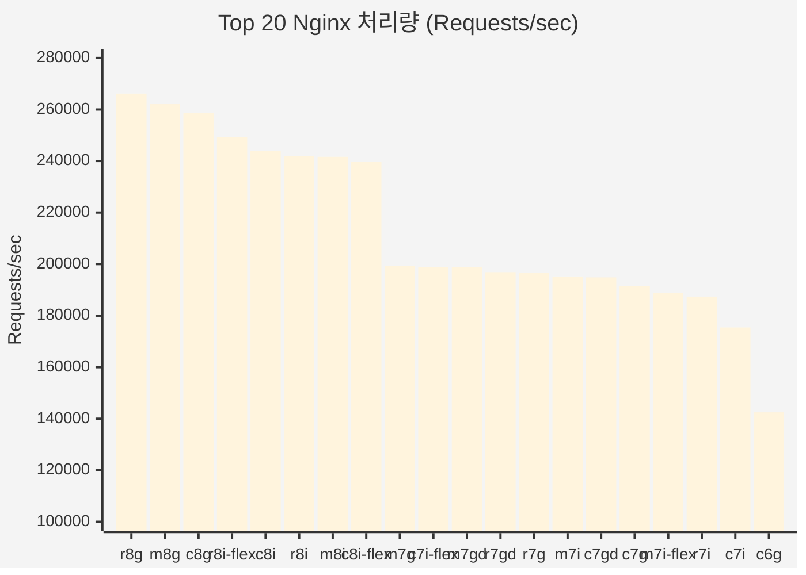
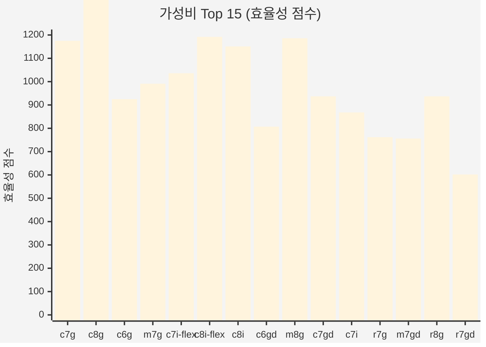

# Nginx (wrk) 벤치마크 리포트

> AWS EC2 인스턴스 51종 성능 비교 분석 (5세대 ~ 8세대)
>
> 2026년 1월 | 서울 리전 (ap-northeast-2) | 테스트 환경: EKS + Karpenter

---

## Executive Summary

### 최고 성능
- **r8g.xlarge** (Graviton4) - 266,160 req/sec, 1.49ms 지연

### 최고 가성비
- **c7g.xlarge** (Graviton3) - 효율성 점수 1,175 (성능/비용 최적)

### 핵심 발견사항
| 항목 | 결과 |
|------|------|
| 8세대 승자 | Graviton4 (Intel 대비 9% 빠름) |
| 세대별 개선 | 5세대 → 8세대: 3배 성능 향상 |
| 아키텍처 우위 | Graviton이 모든 세대에서 Intel 앞섬 |
| AMD 상태 | 5세대만 존재, 최하위 성능 |

---

## 1. 테스트 방법론

### 왜 Nginx 벤치마크가 중요한가?
- **웹 서버 성능**: 실제 HTTP 요청 처리 능력 측정
- **부하 테스트**: 동시 연결 처리 능력
- **지연 시간**: 사용자 경험에 직접적 영향
- **비용 최적화**: 트래픽당 비용 산출 기준

### 테스트 설정
- **도구**: wrk (HTTP 벤치마킹 도구)
- **동시 연결**: 100개 커넥션
- **스레드**: 4개
- **테스트 시간**: 30초
- **대상**: Nginx 정적 파일 서빙

### 수집 메트릭
| 메트릭 | 설명 | 방향 |
|--------|------|------|
| Requests/sec | 초당 처리 요청 수 | 높을수록 좋음 |
| Latency | 평균 응답 지연 시간 | 낮을수록 좋음 |

---

## 2. 테스트 환경

### 인프라 구성
| 항목 | 값 |
|------|-----|
| 플랫폼 | Amazon EKS 1.31 |
| 리전 | ap-northeast-2 (서울) |
| 노드 프로비저너 | Karpenter 1.3.x |
| 컨테이너 런타임 | containerd |

### 인스턴스 구성
| 항목 | 값 |
|------|-----|
| vCPU | 4 (xlarge) |
| 테스트 인스턴스 | 51종 |
| 아키텍처 | x86_64, arm64 |
| 세대 | 5th ~ 8th |

> **참고**: 본 벤치마크는 Kubernetes 환경에서 실행되었으나, 결과는 **범용 EC2 인스턴스 성능 비교**에 적용 가능합니다.

---

## 3. Top 20 성능 순위

> Requests/sec 기준 - 높을수록 좋음



### Top 10 상세

| 순위 | 인스턴스 | 아키텍처 | 세대 | Req/sec | Latency | $/hr | 비고 |
|------|----------|----------|------|---------|---------|------|------|
| 1 | r8g.xlarge | Graviton4 | 8 | 266,160 | 1.49ms | $0.284 | 최고 성능 |
| 2 | m8g.xlarge | Graviton4 | 8 | 262,093 | 1.51ms | $0.221 | 성능/가격 균형 |
| 3 | c8g.xlarge | Graviton4 | 8 | 258,617 | 1.54ms | $0.180 | 저렴한 고성능 |
| 4 | r8i-flex.xlarge | Intel 8 | 8 | 249,220 | 1.60ms | $0.318 | Intel 최고 |
| 5 | c8i.xlarge | Intel 8 | 8 | 243,974 | 1.62ms | $0.212 | - |
| 6 | r8i.xlarge | Intel 8 | 8 | 242,022 | 1.64ms | $0.335 | - |
| 7 | m8i.xlarge | Intel 8 | 8 | 241,635 | 1.62ms | $0.260 | - |
| 8 | c8i-flex.xlarge | Intel 8 | 8 | 239,642 | 1.67ms | $0.201 | flex 가성비 |
| 9 | m7g.xlarge | Graviton3 | 7 | 199,230 | 2.01ms | $0.201 | - |
| 10 | c7i-flex.xlarge | Intel 7 | 7 | 198,849 | 2.04ms | $0.192 | - |

---

## 4. 세대별 성능 비교

### 4.1 Intel/AMD vs Graviton (세대별)

```mermaid
%%{init: {'theme': 'base'}}%%
xychart-beta
    title "세대별 평균 Requests/sec (아키텍처별)"
    x-axis ["5세대", "6세대", "7세대", "8세대"]
    y-axis "Requests/sec" 0 --> 280000
    bar [81161, 126832, 189119, 243193]
    bar [0, 140726, 196267, 262290]
```



| 세대 | Intel/AMD (req/sec) | Graviton (req/sec) | 승자 | 차이 |
|------|---------------------|-------------------|------|------|
| 5세대 | 81,161 | - | Intel | (Graviton 없음) |
| 6세대 | 126,832 | 140,726 | Graviton | +11% |
| 7세대 | 189,119 | 196,267 | Graviton | +4% |
| 8세대 | 243,193 | 262,290 | Graviton | +8% |

### 4.2 세대별 개선율

| 진화 경로 | Intel 개선율 | Graviton 개선율 |
|-----------|-------------|-----------------|
| 5 → 6세대 | +56% | - |
| 6 → 7세대 | +49% | +39% |
| 7 → 8세대 | +29% | +34% |
| **5 → 8세대** | **+200%** | - |
| **6 → 8세대** | - | **+86%** |

---

## 5. 패밀리별 성능 비교

### 아키텍처별 패밀리 성능

```mermaid
%%{init: {'theme': 'base'}}%%
xychart-beta
    title "패밀리별 평균 Requests/sec"
    x-axis ["C (컴퓨팅)", "M (범용)", "R (메모리)"]
    y-axis "Requests/sec" 0 --> 200000
    bar [138855, 127946, 120199]
    bar [181191, 186046, 183766]
```



| 패밀리 | Intel/AMD (req/sec) | Graviton (req/sec) | 승자 | 추천 용도 |
|--------|--------------------|--------------------|------|----------|
| C (컴퓨팅) | 138,855 | 181,191 | Graviton | 웹 서버 |
| M (범용) | 127,946 | 186,046 | Graviton | 일반 워크로드 |
| R (메모리) | 120,199 | 183,766 | Graviton | 캐싱 |

### 핵심 인사이트
- **Graviton이 모든 패밀리에서 우위**: 30-46% 더 높은 처리량
- **C 패밀리가 Intel에서 가장 효율적**: 컴퓨팅 최적화 설계
- **R 패밀리 메모리는 Nginx에 불필요**: 추가 RAM 활용 안됨

---

## 6. 가성비 분석

### 효율성 점수 계산
```
효율성 = requests_per_sec / (price * 1000)
```

### Top 15 가성비 인스턴스



| 순위 | 인스턴스 | 아키텍처 | Req/sec | $/hr | 효율성 | 비고 |
|------|----------|----------|---------|------|--------|------|
| 1 | c8g.xlarge | Graviton4 | 258,617 | $0.180 | 1,437 | 최고 가성비 |
| 2 | c8i-flex.xlarge | Intel 8 | 239,642 | $0.201 | 1,192 | Intel 가성비 |
| 3 | m8g.xlarge | Graviton4 | 262,093 | $0.221 | 1,186 | - |
| 4 | c7g.xlarge | Graviton3 | 191,496 | $0.163 | 1,175 | 최저가 |
| 5 | c8i.xlarge | Intel 8 | 243,974 | $0.212 | 1,151 | - |
| 6 | c7i-flex.xlarge | Intel 7 | 198,849 | $0.192 | 1,036 | - |
| 7 | m7g.xlarge | Graviton3 | 199,230 | $0.201 | 991 | - |
| 8 | c7gd.xlarge | Graviton3 | 194,855 | $0.208 | 937 | - |
| 9 | r8g.xlarge | Graviton4 | 266,160 | $0.284 | 937 | - |
| 10 | c6g.xlarge | Graviton2 | 142,477 | $0.154 | 925 | 예산 절감 |

---

## 7. 지연 시간 분석

### Latency Top 10 (낮을수록 좋음)

| 순위 | 인스턴스 | 아키텍처 | Latency | Req/sec |
|------|----------|----------|---------|---------|
| 1 | r8g.xlarge | Graviton4 | 1.49ms | 266,160 |
| 2 | m8g.xlarge | Graviton4 | 1.51ms | 262,093 |
| 3 | c8g.xlarge | Graviton4 | 1.54ms | 258,617 |
| 4 | r8i-flex.xlarge | Intel 8 | 1.60ms | 249,220 |
| 5 | m8i.xlarge | Intel 8 | 1.62ms | 241,635 |
| 6 | c8i.xlarge | Intel 8 | 1.62ms | 243,974 |
| 7 | r8i.xlarge | Intel 8 | 1.64ms | 242,022 |
| 8 | c8i-flex.xlarge | Intel 8 | 1.67ms | 239,642 |
| 9 | m7g.xlarge | Graviton3 | 2.01ms | 199,230 |
| 10 | m7gd.xlarge | Graviton3 | 2.02ms | 198,822 |

### 지연 시간 분포
- **8세대**: 1.49 ~ 1.67ms (최고)
- **7세대**: 2.01 ~ 2.36ms
- **6세대**: 2.82 ~ 3.34ms
- **5세대 Intel**: 3.30 ~ 4.98ms
- **5세대 AMD**: 7.26 ~ 8.39ms (최악)

---

## 8. 피해야 할 인스턴스

### 최하위 성능 인스턴스

| 인스턴스 | 아키텍처 | Req/sec | Latency | 문제점 | 대안 | 개선 효과 |
|----------|----------|---------|---------|--------|------|----------|
| r5ad.xlarge | AMD | 47,932 | 8.39ms | 최하위 | r8g.xlarge | 5.6배 빠름 |
| r5a.xlarge | AMD | 48,091 | 8.38ms | 구형 EPYC | r8g.xlarge | 5.5배 빠름 |
| m5ad.xlarge | AMD | 49,233 | 8.15ms | 느린 성능 | m8g.xlarge | 5.3배 빠름 |
| m5a.xlarge | AMD | 49,347 | 8.15ms | 비추천 | m8g.xlarge | 5.3배 빠름 |
| c5a.xlarge | AMD | 57,619 | 7.26ms | AMD 최고지만 | c8g.xlarge | 4.5배 빠름 |

### 비용 대비 성능 불량
| 인스턴스 | $/hr | Req/sec | 효율성 | 대안 | 절감 효과 |
|----------|------|---------|--------|------|----------|
| m5zn.xlarge | $0.406 | 122,051 | 301 | m8g.xlarge | 45% 저렴, 2.1배 빠름 |
| r5dn.xlarge | $0.398 | 86,288 | 217 | r8g.xlarge | 29% 저렴, 3.1배 빠름 |
| m6idn.xlarge | $0.386 | 130,869 | 339 | m8g.xlarge | 43% 저렴, 2배 빠름 |

---

## 9. 전체 결과 테이블

| 순위 | 인스턴스 | 아키텍처 | 세대 | 패밀리 | Req/sec | Latency | $/hr | 효율성 |
|------|----------|----------|------|--------|---------|---------|------|--------|
| 1 | r8g.xlarge | Graviton | 8 | R | 266,160 | 1.49ms | $0.284 | 937 |
| 2 | m8g.xlarge | Graviton | 8 | M | 262,093 | 1.51ms | $0.221 | 1,186 |
| 3 | c8g.xlarge | Graviton | 8 | C | 258,617 | 1.54ms | $0.180 | 1,437 |
| 4 | r8i-flex.xlarge | Intel | 8 | R | 249,220 | 1.60ms | $0.318 | 784 |
| 5 | c8i.xlarge | Intel | 8 | C | 243,974 | 1.62ms | $0.212 | 1,151 |
| 6 | r8i.xlarge | Intel | 8 | R | 242,022 | 1.64ms | $0.335 | 722 |
| 7 | m8i.xlarge | Intel | 8 | M | 241,635 | 1.62ms | $0.260 | 929 |
| 8 | c8i-flex.xlarge | Intel | 8 | C | 239,642 | 1.67ms | $0.201 | 1,192 |
| 9 | m7g.xlarge | Graviton | 7 | M | 199,230 | 2.01ms | $0.201 | 991 |
| 10 | c7i-flex.xlarge | Intel | 7 | C | 198,849 | 2.04ms | $0.192 | 1,036 |
| 11 | m7gd.xlarge | Graviton | 7 | M | 198,822 | 2.02ms | $0.263 | 756 |
| 12 | r7gd.xlarge | Graviton | 7 | R | 196,871 | 2.04ms | $0.327 | 602 |
| 13 | r7g.xlarge | Graviton | 7 | R | 196,593 | 2.05ms | $0.258 | 762 |
| 14 | m7i.xlarge | Intel | 7 | M | 195,187 | 2.09ms | $0.248 | 787 |
| 15 | c7gd.xlarge | Graviton | 7 | C | 194,855 | 2.10ms | $0.208 | 937 |
| 16 | c7g.xlarge | Graviton | 7 | C | 191,496 | 2.09ms | $0.163 | 1,175 |
| 17 | m7i-flex.xlarge | Intel | 7 | M | 188,787 | 2.36ms | $0.235 | 803 |
| 18 | r7i.xlarge | Intel | 7 | R | 187,384 | 2.16ms | $0.319 | 587 |
| 19 | c7i.xlarge | Intel | 7 | C | 175,420 | 2.30ms | $0.202 | 868 |
| 20 | c6g.xlarge | Graviton | 6 | C | 142,477 | 2.82ms | $0.154 | 925 |
| 21 | m6gd.xlarge | Graviton | 6 | M | 142,108 | 2.83ms | $0.222 | 640 |
| 22 | c6gd.xlarge | Graviton | 6 | C | 142,052 | 2.82ms | $0.176 | 807 |
| 23 | r6g.xlarge | Graviton | 6 | R | 140,431 | 2.86ms | $0.244 | 575 |
| 24 | m6g.xlarge | Graviton | 6 | M | 139,951 | 2.87ms | $0.188 | 744 |
| 25 | r6gd.xlarge | Graviton | 6 | R | 139,341 | 2.91ms | $0.277 | 503 |
| 26 | c6gn.xlarge | Graviton | 6 | C | 138,721 | 2.90ms | $0.195 | 711 |
| 27 | c6id.xlarge | Intel | 6 | C | 131,623 | 3.06ms | $0.231 | 570 |
| 28 | m6idn.xlarge | Intel | 6 | M | 130,869 | 3.07ms | $0.386 | 339 |
| 29 | m6i.xlarge | Intel | 6 | M | 130,251 | 3.09ms | $0.236 | 552 |
| 30 | m6id.xlarge | Intel | 6 | M | 129,777 | 3.10ms | $0.292 | 444 |
| 31 | c6in.xlarge | Intel | 6 | C | 128,376 | 3.13ms | $0.256 | 501 |
| 32 | r6id.xlarge | Intel | 6 | R | 125,469 | 3.20ms | $0.363 | 346 |
| 33 | m6in.xlarge | Intel | 6 | M | 124,705 | 3.22ms | $0.337 | 370 |
| 34 | m5zn.xlarge | Intel | 5 | M | 122,051 | 3.30ms | $0.406 | 301 |
| 35 | c6i.xlarge | Intel | 6 | C | 121,490 | 3.34ms | $0.192 | 633 |
| 36 | r6i.xlarge | Intel | 6 | R | 120,931 | 3.33ms | $0.304 | 398 |
| 37 | c5n.xlarge | Intel | 5 | C | 89,240 | 4.50ms | $0.244 | 366 |
| 38 | c5.xlarge | Intel | 5 | C | 87,918 | 4.67ms | $0.192 | 458 |
| 39 | r5dn.xlarge | Intel | 5 | R | 86,288 | 4.65ms | $0.398 | 217 |
| 40 | r5b.xlarge | Intel | 5 | R | 85,655 | 4.70ms | $0.356 | 241 |
| 41 | m5.xlarge | Intel | 5 | M | 85,543 | 4.71ms | $0.236 | 362 |
| 42 | m5d.xlarge | Intel | 5 | M | 84,654 | 4.76ms | $0.278 | 305 |
| 43 | r5d.xlarge | Intel | 5 | R | 83,873 | 4.81ms | $0.346 | 242 |
| 44 | c5d.xlarge | Intel | 5 | C | 83,394 | 4.40ms | $0.220 | 379 |
| 45 | r5.xlarge | Intel | 5 | R | 82,337 | 4.98ms | $0.304 | 271 |
| 46 | r5n.xlarge | Intel | 5 | R | 81,988 | 4.90ms | $0.356 | 230 |
| 47 | c5a.xlarge | AMD | 5 | C | 57,619 | 7.26ms | $0.172 | 335 |
| 48 | m5a.xlarge | AMD | 5 | M | 49,347 | 8.15ms | $0.212 | 233 |
| 49 | m5ad.xlarge | AMD | 5 | M | 49,233 | 8.15ms | $0.254 | 194 |
| 50 | r5a.xlarge | AMD | 5 | R | 48,091 | 8.38ms | $0.272 | 177 |
| 51 | r5ad.xlarge | AMD | 5 | R | 47,932 | 8.39ms | $0.316 | 152 |

---

## 10. 결론 및 추천

### 핵심 시사점

1. **Graviton4가 Nginx에서 압도적**: 모든 메트릭에서 Intel 대비 8-10% 우위
2. **8세대로 업그레이드 필수**: 5세대 대비 3-5배 성능 향상
3. **C 패밀리가 웹 서버에 최적**: 컴퓨팅 집약 워크로드
4. **AMD EPYC 5세대 사용 금지**: Intel/Graviton 대비 40-70% 느림
5. **flex 인스턴스 활용**: 표준 버전과 유사한 성능, 더 저렴

### 용도별 추천

| 용도 | 추천 인스턴스 | Req/sec | Latency | $/hr | 선택 이유 |
|------|--------------|---------|---------|------|----------|
| **최고 성능** | r8g.xlarge | 266,160 | 1.49ms | $0.284 | 모든 메트릭 1위 |
| **최고 가성비** | c8g.xlarge | 258,617 | 1.54ms | $0.180 | 효율성 점수 1위 |
| **x86 필수** | c8i-flex.xlarge | 239,642 | 1.67ms | $0.201 | Intel 가성비 최고 |
| **예산 절감** | c6g.xlarge | 142,477 | 2.82ms | $0.154 | 가장 저렴한 옵션 |
| **고트래픽** | m8g.xlarge | 262,093 | 1.51ms | $0.221 | 성능/비용 균형 |

### 최종 추천

#### 범용 Nginx 워크로드
```
c8g.xlarge (Graviton4)
- 258,617 req/sec
- 1.54ms latency
- $0.180/hr
- 효율성 점수: 1,437 (1위)
```

**Intel 대비 15% 비용 절감, Top 3 성능, 가성비 최고**

---

## 부록: 테스트 환경 상세

### Pod Anti-affinity 설정
```yaml
affinity:
  podAntiAffinity:
    requiredDuringSchedulingIgnoredDuringExecution:
      - labelSelector:
          matchExpressions:
            - key: benchmark
              operator: Exists
        topologyKey: "kubernetes.io/hostname"
```

### 테스트 격리 보장
- 각 벤치마크가 전용 노드에서 단독 실행
- Karpenter로 인스턴스 타입별 새 노드 동적 프로비저닝
- 다른 워크로드 없이 격리된 환경에서 측정

---

*벤치마크 자동화 시스템 | 데이터 수집: 2026년 1월 | 리전: ap-northeast-2 (서울)*
