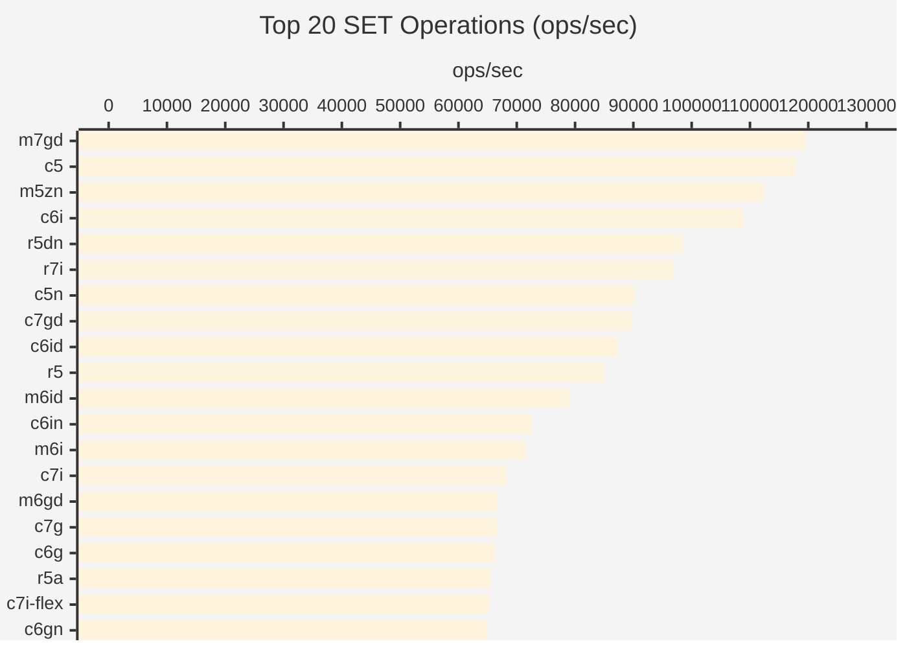
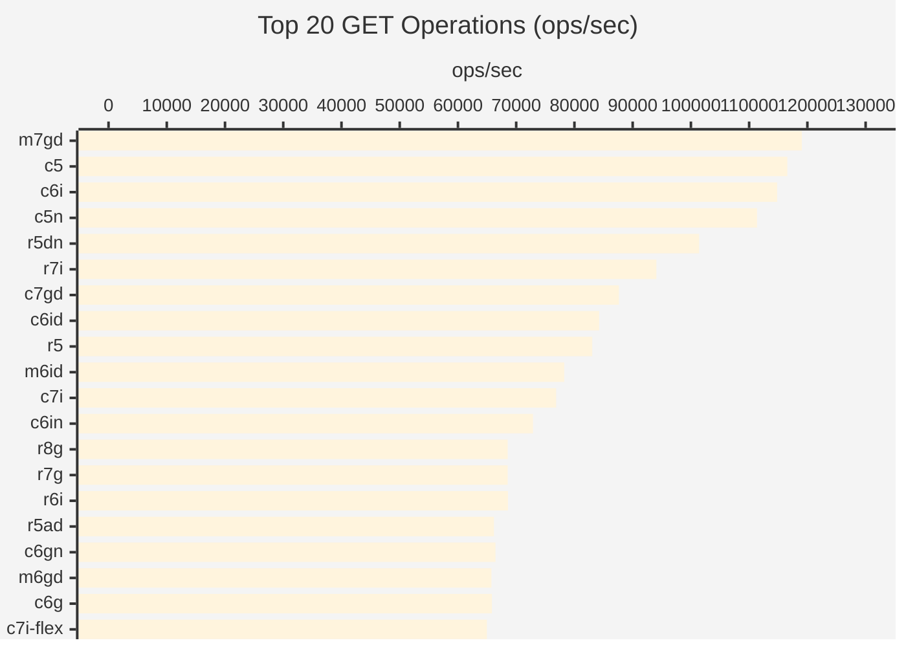
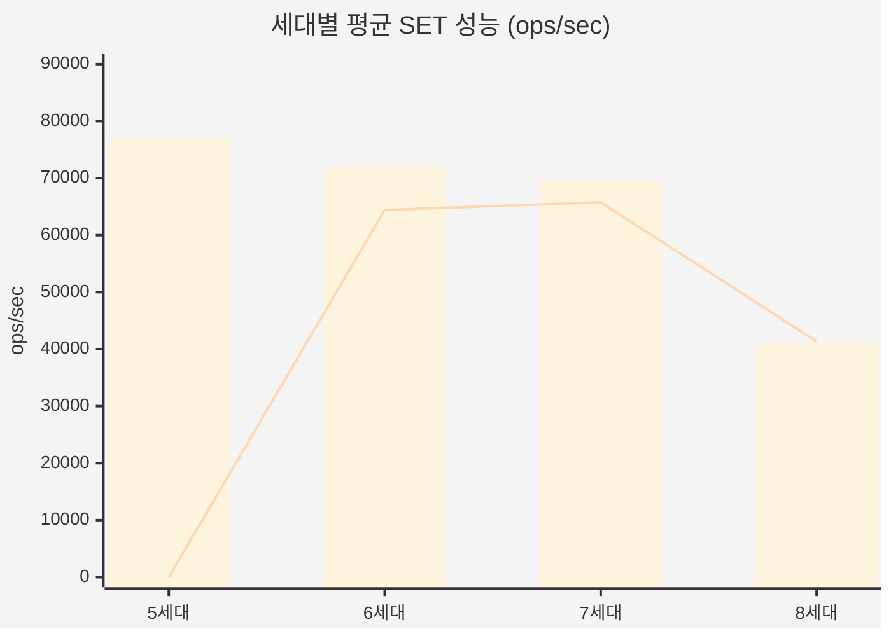
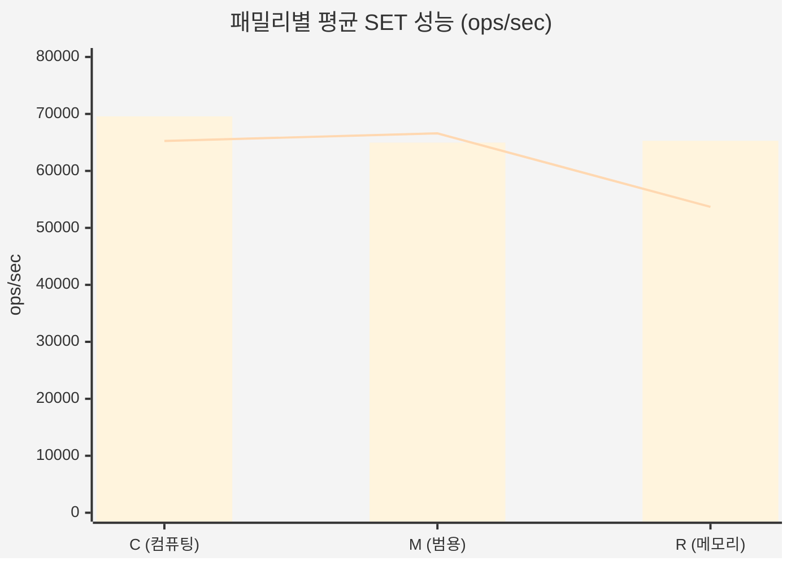
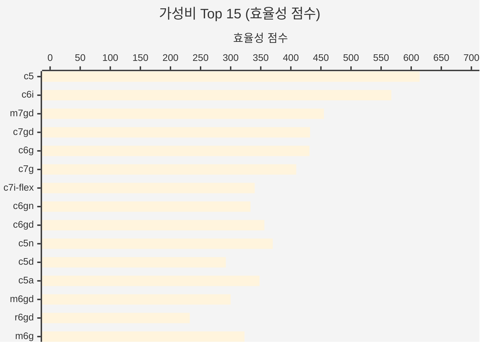
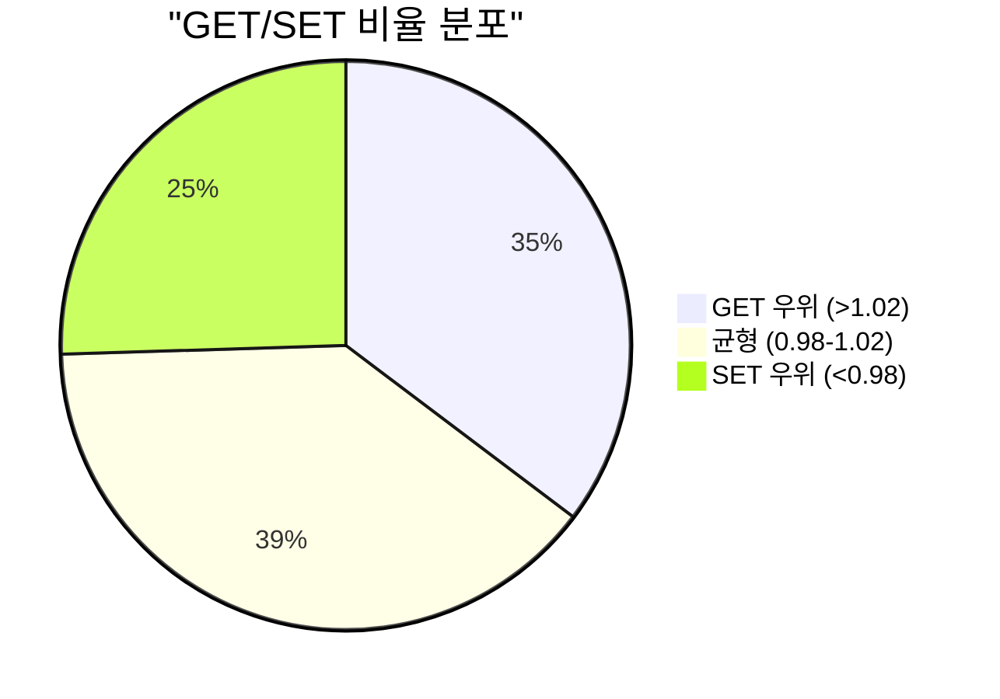

# Redis 벤치마크 리포트

> AWS EC2 인스턴스 51종 성능 비교 분석 (5세대 ~ 8세대)
>
> 2026년 1월 | 서울 리전 (ap-northeast-2) | 테스트 환경: EKS + Karpenter

---

## Executive Summary

### 주요 발견

| 항목 | 인스턴스 | 결과 |
|------|----------|------|
| **SET 최고 성능** | m7gd.xlarge (Graviton) | 119,617 ops/sec |
| **GET 최고 성능** | m7gd.xlarge (Graviton) | 119,047 ops/sec |
| **최고 가성비** | c6g.xlarge (Graviton) | 효율성 431점 |
| **세대별 승자** | 5-6세대 혼합 | 상위권 다수 |

### 핵심 인사이트

1. **Graviton 7세대가 최강** - m7gd.xlarge가 SET 성능 1위 (119,617 ops/sec)
2. **Intel 5세대도 선전** - c5.xlarge가 2위 (117,924 ops/sec)
3. **가성비는 Graviton** - c6g.xlarge가 저렴한 가격($0.154)으로 높은 효율성
4. **8세대는 Redis에서 저조** - 5-6세대보다 낮은 처리량

---

## 1. 테스트 방법론

### 측정 메트릭

| 메트릭 | 설명 | 단위 | 방향 |
|--------|------|------|------|
| SET ops/sec | Redis SET 명령어 처리량 | ops/sec | 높을수록 좋음 |
| GET ops/sec | Redis GET 명령어 처리량 | ops/sec | 높을수록 좋음 |
| 효율성 | set_ops / (price * 1000) | 점수 | 높을수록 좋음 |

### 테스트 환경

- **플랫폼**: Amazon EKS 1.31
- **리전**: ap-northeast-2 (서울)
- **노드 프로비저너**: Karpenter 1.3.x
- **인스턴스 크기**: xlarge (4 vCPU)
- **테스트 인스턴스**: 51종
- **테스트 도구**: redis-benchmark (Standard mode)

---

## 2. Top 20 SET 성능

> 높을수록 좋음 | 초록: Graviton, 파랑: Intel, 빨강: AMD



### Top 10 SET 성능 상세

| 순위 | 인스턴스 | 아키텍처 | 세대 | SET ops/sec | 가격 ($/hr) |
|------|----------|----------|------|-------------|-------------|
| 1 | m7gd.xlarge | Graviton | 7 | 119,617 | $0.263 |
| 2 | c5.xlarge | Intel | 5 | 117,924 | $0.192 |
| 3 | m5zn.xlarge | Intel | 5 | 112,485 | $0.406 |
| 4 | c6i.xlarge | Intel | 6 | 108,932 | $0.192 |
| 5 | r5dn.xlarge | Intel | 5 | 98,522 | $0.398 |
| 6 | r7i.xlarge | Intel | 7 | 96,993 | $0.319 |
| 7 | c5n.xlarge | Intel | 5 | 90,252 | $0.244 |
| 8 | c7gd.xlarge | Graviton | 7 | 89,766 | $0.208 |
| 9 | c6id.xlarge | Intel | 6 | 87,336 | $0.231 |
| 10 | r5.xlarge | Intel | 5 | 85,106 | $0.304 |

---

## 3. Top 20 GET 성능



### SET vs GET 성능 비교 (Top 10)

| 순위 | 인스턴스 | SET ops/sec | GET ops/sec | GET/SET 비율 |
|------|----------|-------------|-------------|--------------|
| 1 | m7gd.xlarge | 119,617 | 119,047 | 1.00 |
| 2 | c5.xlarge | 117,924 | 116,550 | 0.99 |
| 3 | m5zn.xlarge | 112,485 | 101,112 | 0.90 |
| 4 | c6i.xlarge | 108,932 | 114,810 | 1.05 |
| 5 | r5dn.xlarge | 98,522 | 101,419 | 1.03 |

---

## 4. 세대별 성능 비교

### 아키텍처별 세대 비교 (SET ops/sec)



### Intel/AMD vs Graviton 세대별 비교

| 세대 | Intel/AMD 평균 | Graviton 평균 | 승자 |
|------|---------------|---------------|------|
| 5세대 | 76,809 ops/sec | - | Intel |
| 6세대 | 72,101 ops/sec | 64,422 ops/sec | Intel |
| 7세대 | 67,740 ops/sec | 65,765 ops/sec | Intel |
| 8세대 | 40,612 ops/sec | 41,354 ops/sec | **Graviton** |

### 핵심 인사이트

- **5세대 Intel이 여전히 강력** - c5.xlarge가 2위 기록
- **7세대 Graviton 선전** - m7gd가 전체 1위
- **8세대는 Redis에서 저조** - 아직 Redis 최적화 미흡

---

## 5. 패밀리별 성능 비교

### C/M/R 패밀리별 SET 성능



### 패밀리별 상세 비교

| 패밀리 | Intel/AMD 평균 | Graviton 평균 | 최고 인스턴스 |
|--------|---------------|---------------|---------------|
| C (컴퓨팅) | 69,573 ops/sec | 65,259 ops/sec | c5.xlarge (118K) |
| M (범용) | 64,969 ops/sec | 66,588 ops/sec | m7gd.xlarge (120K) |
| R (메모리) | 65,283 ops/sec | 53,685 ops/sec | r5dn.xlarge (99K) |

### 패밀리 선택 가이드

| 용도 | 추천 패밀리 | 이유 |
|------|------------|------|
| Redis 캐시 | **C (컴퓨팅)** | CPU 집약적 워크로드에 최적 |
| 범용 KV 스토어 | **M (범용)** | m7gd가 최고 성능 기록 |
| 대용량 데이터셋 | **R (메모리)** | 메모리 용량 필요 시 |

---

## 6. 가성비 분석

### 효율성 공식

```
효율성 점수 = SET ops/sec / (시간당 가격 x 1000)
```

### Top 15 가성비 인스턴스



### 가성비 Top 10 상세

| 순위 | 인스턴스 | SET ops/sec | 가격 ($/hr) | 효율성 점수 |
|------|----------|-------------|-------------|-------------|
| 1 | c5.xlarge | 117,924 | $0.192 | **614** |
| 2 | c6i.xlarge | 108,932 | $0.192 | 567 |
| 3 | m7gd.xlarge | 119,617 | $0.263 | 455 |
| 4 | c7gd.xlarge | 89,766 | $0.208 | 432 |
| 5 | c6g.xlarge | 66,313 | $0.154 | 431 |
| 6 | c7g.xlarge | 66,622 | $0.163 | 409 |
| 7 | c5n.xlarge | 90,252 | $0.244 | 370 |
| 8 | c6gd.xlarge | 62,695 | $0.176 | 356 |
| 9 | c5a.xlarge | 59,916 | $0.172 | 348 |
| 10 | c7i-flex.xlarge | 65,316 | $0.192 | 340 |

### 가격 대비 성능 분포

| 가격대 | 인스턴스 | 성능 범위 | 추천 |
|--------|----------|-----------|------|
| $0.15-0.20 | c6g, c7g, c6gd, c5a, c7i-flex, c8g | 40K-67K | 예산 절감 |
| $0.20-0.25 | c5, c6i, c7gd, m7g, c7i, m6g | 43K-118K | **최고 가성비** |
| $0.25-0.35 | m7gd, r6g, r7g, m8g, r6i, r7i | 40K-120K | 고성능 |
| $0.35+ | m5zn, r5dn, r5n, r5b, m6idn | 42K-112K | 프리미엄 |

---

## 7. SET vs GET 성능 분석

### 성능 상관관계

대부분의 인스턴스에서 SET과 GET 성능은 유사한 패턴을 보임:

| 패턴 | 인스턴스 | GET/SET 비율 | 특징 |
|------|----------|--------------|------|
| GET 우위 | c6i, r5dn, c5n, r7g | 1.03-1.23 | 읽기 최적화 |
| 균형 | m7gd, c5, c7gd | 0.98-1.00 | 대부분 |
| SET 우위 | m5zn, m6i, c6in | 0.80-0.90 | 쓰기 최적화 |

### GET/SET 비율 분포



---

## 8. 세대별 성능 트렌드 분석

### Intel 세대별 진화

| 세대 | 평균 SET | 대표 인스턴스 | 특징 |
|------|----------|--------------|------|
| 5세대 | 76,809 | c5 (118K) | 여전히 강력 |
| 6세대 | 72,101 | c6i (109K) | 안정적 |
| 7세대 | 67,740 | r7i (97K) | 양호 |
| 8세대 | 40,612 | c8i (42K) | 최적화 필요 |

### Graviton 세대별 진화

| 세대 | 평균 SET | 대표 인스턴스 | 특징 |
|------|----------|--------------|------|
| 6세대 | 64,422 | c6g (66K) | 균형 |
| 7세대 | 65,765 | m7gd (120K) | **최강** |
| 8세대 | 41,354 | c8g (41K) | 최적화 필요 |

### 핵심 인사이트

- **신세대 ≠ 고성능 (Redis)** - 8세대가 가장 낮은 처리량
- **m7gd가 예외적 성능** - NVMe 로컬 스토리지 효과 가능성
- **c5/c6i가 가성비 최강** - 저렴하면서 최상위 성능

---

## 9. 피해야 할 인스턴스

### 최하위 성능 그룹

| 인스턴스 | SET ops/sec | 문제점 | 대안 | 개선 효과 |
|----------|-------------|--------|------|-----------|
| c8i-flex.xlarge | 39,416 | 8세대 최저 성능 | c6i.xlarge | 2.8x 빠름 |
| m8i.xlarge | 39,510 | 8세대 범용 최저 | m7gd.xlarge | 3x 빠름 |
| r8g.xlarge | 40,469 | Graviton 8세대 저조 | r7i.xlarge | 2.4x 빠름 |
| r8i-flex.xlarge | 40,535 | Intel 8세대 저조 | r5.xlarge | 2.1x 빠름 |
| r6id.xlarge | 41,152 | 고가+저성능 | r5.xlarge | 2x 빠름 |

### 피해야 할 이유

1. **8세대 전체** - Redis에서 5-7세대보다 낮은 성능
2. **flex 인스턴스** - Redis에서 버스팅 이점 없음
3. **네트워크 최적화 인스턴스 (n/in 접미사)** - Redis는 네트워크 바운드 아님

---

## 10. 전체 결과 테이블

### 성능순 정렬 (SET ops/sec 기준)

| 순위 | 인스턴스 | 아키텍처 | 세대 | 패밀리 | SET ops/sec | GET ops/sec | 가격 | 효율성 |
|------|----------|----------|------|--------|-------------|-------------|------|--------|
| 1 | m7gd.xlarge | Graviton | 7 | M | 119,617 | 119,047 | $0.263 | 455 |
| 2 | c5.xlarge | Intel | 5 | C | 117,924 | 116,550 | $0.192 | 614 |
| 3 | m5zn.xlarge | Intel | 5 | M | 112,485 | 101,112 | $0.406 | 277 |
| 4 | c6i.xlarge | Intel | 6 | C | 108,932 | 114,810 | $0.192 | 567 |
| 5 | r5dn.xlarge | Intel | 5 | R | 98,522 | 101,419 | $0.398 | 248 |
| 6 | r7i.xlarge | Intel | 7 | R | 96,993 | 94,073 | $0.319 | 304 |
| 7 | c5n.xlarge | Intel | 5 | C | 90,252 | 111,358 | $0.244 | 370 |
| 8 | c7gd.xlarge | Graviton | 7 | C | 89,766 | 87,642 | $0.208 | 432 |
| 9 | c6id.xlarge | Intel | 6 | C | 87,336 | 84,245 | $0.231 | 378 |
| 10 | r5.xlarge | Intel | 5 | R | 85,106 | 83,056 | $0.304 | 280 |
| 11 | m6id.xlarge | Intel | 6 | M | 79,051 | 78,247 | $0.292 | 271 |
| 12 | c6in.xlarge | Intel | 6 | C | 72,674 | 72,886 | $0.256 | 284 |
| 13 | m6i.xlarge | Intel | 6 | M | 71,530 | 56,721 | $0.236 | 303 |
| 14 | c7i.xlarge | Intel | 7 | C | 68,259 | 76,863 | $0.202 | 338 |
| 15 | m6gd.xlarge | Graviton | 6 | M | 66,711 | 65,746 | $0.222 | 300 |
| 16 | c7g.xlarge | Graviton | 7 | C | 66,622 | 63,694 | $0.163 | 409 |
| 17 | c6g.xlarge | Graviton | 6 | C | 66,313 | 65,832 | $0.154 | 431 |
| 18 | r5a.xlarge | AMD | 5 | R | 65,573 | 61,538 | $0.272 | 241 |
| 19 | c7i-flex.xlarge | Intel | 7 | C | 65,316 | 64,977 | $0.192 | 340 |
| 20 | c6gn.xlarge | Graviton | 6 | C | 64,935 | 66,445 | $0.195 | 333 |
| 21 | r5ad.xlarge | AMD | 5 | R | 64,599 | 66,181 | $0.316 | 204 |
| 22 | m5a.xlarge | AMD | 5 | M | 64,557 | 65,832 | $0.212 | 305 |
| 23 | c5d.xlarge | Intel | 5 | C | 64,308 | 64,892 | $0.220 | 292 |
| 24 | r6gd.xlarge | Graviton | 6 | R | 64,267 | 66,533 | $0.277 | 232 |
| 25 | m7i-flex.xlarge | Intel | 7 | M | 64,061 | 63,572 | $0.235 | 273 |
| 26 | r5n.xlarge | Intel | 5 | R | 64,020 | 63,331 | $0.356 | 180 |
| 27 | r6g.xlarge | Graviton | 6 | R | 63,371 | 62,150 | $0.244 | 260 |
| 28 | m5d.xlarge | Intel | 5 | M | 63,051 | 60,827 | $0.278 | 227 |
| 29 | m5.xlarge | Intel | 5 | M | 63,011 | 61,462 | $0.236 | 267 |
| 30 | c6gd.xlarge | Graviton | 6 | C | 62,695 | 62,774 | $0.176 | 356 |
| 31 | m5ad.xlarge | AMD | 5 | M | 61,652 | 60,060 | $0.254 | 243 |
| 32 | r6i.xlarge | Intel | 6 | R | 60,975 | 68,587 | $0.304 | 201 |
| 33 | m6g.xlarge | Graviton | 6 | M | 60,716 | 62,266 | $0.188 | 323 |
| 34 | c5a.xlarge | AMD | 5 | C | 59,916 | 60,827 | $0.172 | 348 |
| 35 | r5b.xlarge | Intel | 5 | R | 57,870 | 58,858 | $0.356 | 163 |
| 36 | r5d.xlarge | Intel | 5 | R | 57,870 | 58,072 | $0.346 | 167 |
| 37 | r7g.xlarge | Graviton | 7 | R | 57,836 | 68,540 | $0.258 | 224 |
| 38 | m7i.xlarge | Intel | 7 | M | 44,072 | 43,744 | $0.248 | 178 |
| 39 | m7g.xlarge | Graviton | 7 | M | 43,365 | 42,826 | $0.201 | 216 |
| 40 | m6in.xlarge | Intel | 6 | M | 42,698 | 42,247 | $0.337 | 127 |
| 41 | m6idn.xlarge | Intel | 6 | M | 42,589 | 42,354 | $0.386 | 110 |
| 42 | r8i.xlarge | Intel | 8 | R | 42,535 | 42,105 | $0.335 | 127 |
| 43 | r7gd.xlarge | Graviton | 7 | R | 42,480 | 42,408 | $0.327 | 130 |
| 44 | c8i.xlarge | Intel | 8 | C | 42,426 | 41,390 | $0.212 | 200 |
| 45 | m8g.xlarge | Graviton | 8 | M | 42,372 | 41,753 | $0.221 | 192 |
| 46 | c8g.xlarge | Graviton | 8 | C | 41,220 | 40,633 | $0.180 | 229 |
| 47 | r6id.xlarge | Intel | 6 | R | 41,152 | 42,016 | $0.363 | 113 |
| 48 | r8i-flex.xlarge | Intel | 8 | R | 40,535 | 40,966 | $0.318 | 127 |
| 49 | r8g.xlarge | Graviton | 8 | R | 40,469 | 37,950 | $0.284 | 143 |
| 50 | m8i.xlarge | Intel | 8 | M | 39,510 | 39,215 | $0.260 | 152 |
| 51 | c8i-flex.xlarge | Intel | 8 | C | 39,416 | 39,093 | $0.201 | 196 |

---

## 11. 결론 및 추천

### 용도별 추천 인스턴스

| 용도 | 추천 인스턴스 | SET ops/sec | 가격 | 선택 이유 |
|------|--------------|-------------|------|-----------|
| **최고 성능** | m7gd.xlarge | 119,617 | $0.263 | SET/GET 모두 최상위 |
| **최고 가성비** | c5.xlarge | 117,924 | $0.192 | 효율성 614점 (1위) |
| **x86 필수 시** | c5.xlarge | 117,924 | $0.192 | Intel 최고 성능 |
| **Graviton 선호** | m7gd.xlarge | 119,617 | $0.263 | Graviton 최고 성능 |
| **예산 절감** | c6g.xlarge | 66,313 | $0.154 | 가장 저렴 + 양호 성능 |
| **대용량 메모리** | r5.xlarge | 85,106 | $0.304 | 32GB RAM + 고성능 |

### 핵심 시사점

1. **m7gd.xlarge가 전체 1위** - Graviton 7세대의 NVMe 스토리지 버전이 최강
2. **5-6세대가 Redis에 최적** - c5, c6i가 가성비 최고
3. **8세대는 Redis에서 저조** - 모든 8세대 인스턴스가 하위권
4. **flex 인스턴스 피하기** - Redis에서 버스팅 이점 없음
5. **가성비 = c5.xlarge** - 최고 성능 + 낮은 가격

### 최종 추천

```
+------------------------------------------+
|       범용 Redis 캐시 워크로드            |
|                                          |
|           c5.xlarge (Intel 5세대)         |
|                                          |
|    117,924 ops/sec | $0.192/hr           |
|    효율성 점수 614점 (1위)                |
|                                          |
|    8세대 대비 3배 빠름                    |
|    Top 2 성능 | 가성비 최고               |
+------------------------------------------+
```

```
+------------------------------------------+
|       최고 성능 워크로드                  |
|                                          |
|         m7gd.xlarge (Graviton 7세대)      |
|                                          |
|    119,617 ops/sec | $0.263/hr           |
|    전체 성능 1위                          |
|                                          |
|    NVMe 로컬 스토리지 포함                |
|    SET/GET 모두 최강                      |
+------------------------------------------+
```

---

## 부록: 데이터 출처

- **테스트 도구**: redis-benchmark (Standard mode, 50 clients, 100000 requests)
- **테스트 날짜**: 2026년 1월
- **테스트 환경**: Amazon EKS 1.31, Karpenter 1.3.x
- **리전**: ap-northeast-2 (서울)
- **데이터 파일**: `/home/ec2-user/benchmark/results/redis/benchmark-data.csv`

---

*이 보고서는 EC2 인스턴스 벤치마크 자동화 시스템에 의해 생성되었습니다.*
