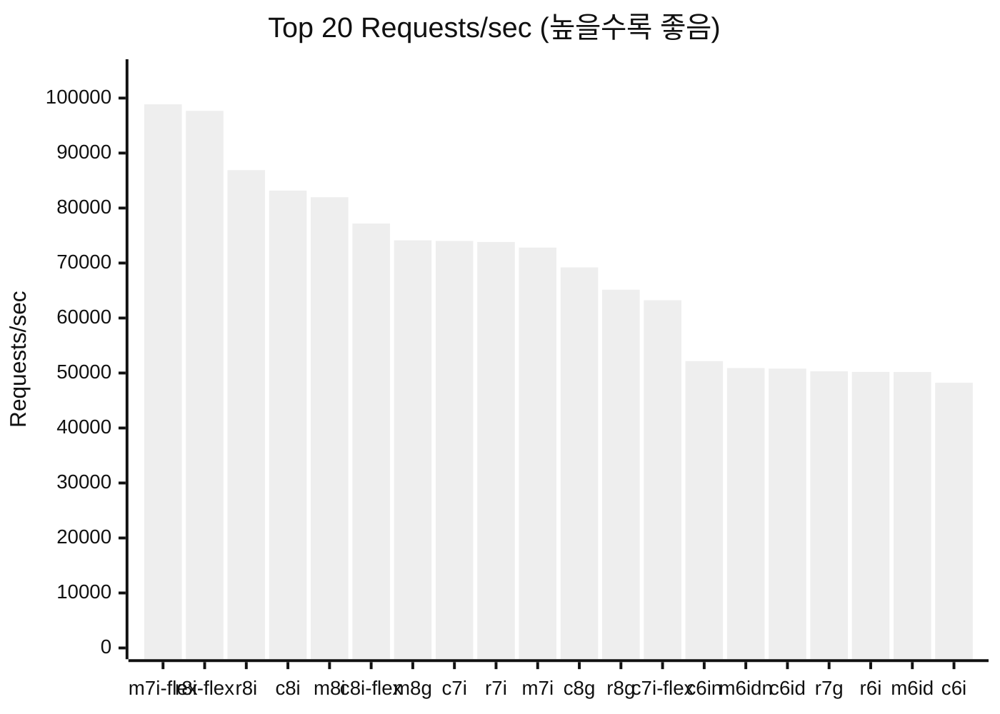
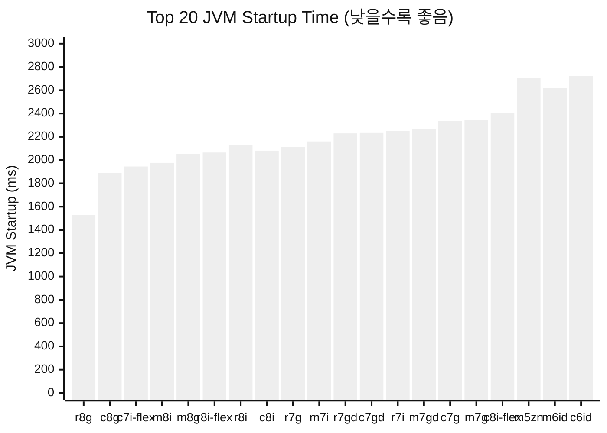
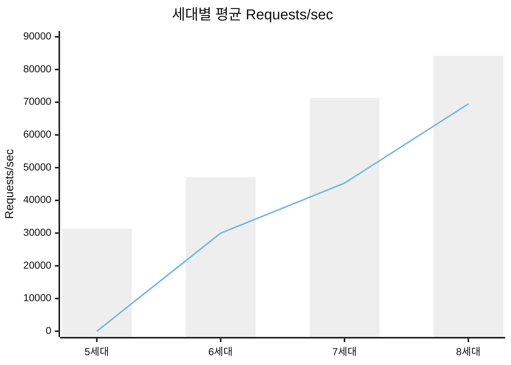
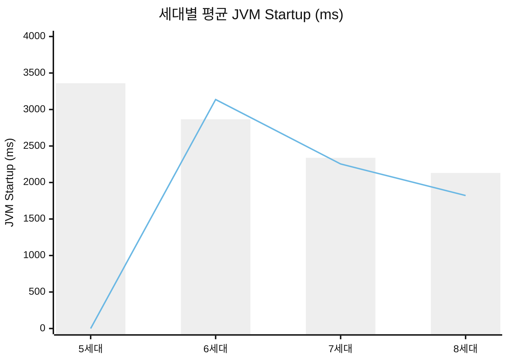
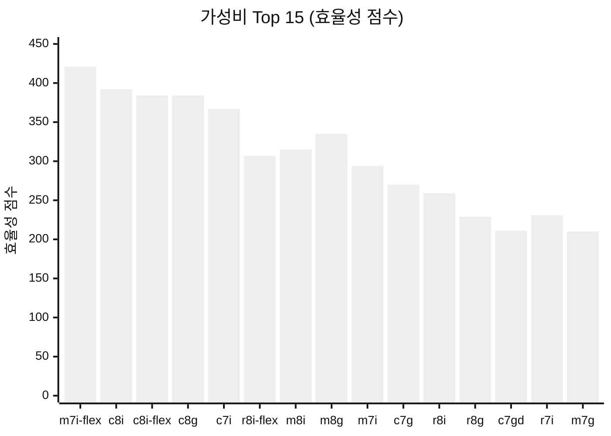

# Spring Boot 벤치마크 리포트

> AWS EC2 인스턴스 51종 성능 비교 분석 (5세대 ~ 8세대)
> 2026년 1월 | 서울 리전 (ap-northeast-2)

---

## Executive Summary

### 핵심 발견

| 항목 | 최고 성능 인스턴스 | 수치 | 특징 |
|------|-------------------|------|------|
| **처리량 (Throughput)** | m7i-flex.xlarge | 98,864 req/s | Intel 7세대 flex |
| **JVM 시작 속도** | r8g.xlarge | 1,527ms | Graviton 8세대 |
| **최저 지연** | r8i-flex.xlarge | 2.05ms | Intel 8세대 flex |
| **최고 가성비** | m7i-flex.xlarge | 421 효율점수 | Intel 7세대 flex |

### 주요 인사이트

1. **Intel 7-8세대가 처리량 지배**: m7i-flex (99K), r8i-flex (98K), r8i (87K) req/s
2. **Graviton 8세대가 JVM Cold Start 최강**: r8g(1527ms) > c8g(1888ms) > m8g(2051ms)
3. **Serverless/FaaS 환경**: Graviton 8세대 추천 (빠른 Cold Start)
4. **고처리량 필요 환경**: Intel 7-8세대 추천 (높은 req/s)

---

## 1. 테스트 방법론

### 수집 메트릭

| 메트릭 | 설명 | 방향 |
|--------|------|------|
| Requests/sec | HTTP 요청 처리량 | 높을수록 좋음 |
| Latency (ms) | 평균 응답 지연 | 낮을수록 좋음 |
| JVM Startup (ms) | JVM 부팅 시간 | 낮을수록 좋음 |
| Cold Start to HTTP (ms) | Pod 시작~HTTP 준비 | 낮을수록 좋음 |

### 테스트 환경

- **플랫폼**: Amazon EKS 1.31 + Karpenter
- **리전**: ap-northeast-2 (서울)
- **인스턴스 크기**: xlarge (4 vCPU)
- **격리**: Pod Anti-affinity로 노드당 1개 벤치마크 실행

---

## 2. Top 20 Requests/sec (처리량)

> 높을수록 좋음 | Intel이 처리량에서 우위



### 상위 10개 상세

| 순위 | 인스턴스 | 아키텍처 | 세대 | Req/s | 지연(ms) | 가격($/hr) |
|------|---------|---------|------|-------|---------|-----------|
| 1 | m7i-flex.xlarge | Intel | 7 | 98,864 | 2.06 | $0.235 |
| 2 | r8i-flex.xlarge | Intel | 8 | 97,673 | 2.05 | $0.318 |
| 3 | r8i.xlarge | Intel | 8 | 86,894 | 2.22 | $0.335 |
| 4 | c8i.xlarge | Intel | 8 | 83,175 | 2.33 | $0.212 |
| 5 | m8i.xlarge | Intel | 8 | 81,969 | 2.38 | $0.260 |
| 6 | c8i-flex.xlarge | Intel | 8 | 77,183 | 2.53 | $0.201 |
| 7 | **m8g.xlarge** | **Graviton** | **8** | **74,131** | 2.69 | $0.221 |
| 8 | c7i.xlarge | Intel | 7 | 74,023 | 2.67 | $0.202 |
| 9 | r7i.xlarge | Intel | 7 | 73,832 | 2.63 | $0.319 |
| 10 | m7i.xlarge | Intel | 7 | 72,817 | 2.67 | $0.248 |

**분석**: Intel 7-8세대가 Top 10 중 9개 차지. Graviton 최고 성능은 m8g (7위).

---

## 3. Top 20 JVM Startup Time (Cold Start)

> 낮을수록 좋음 | Serverless/FaaS 환경에서 중요



### Graviton 8세대의 JVM Cold Start 우위

| 순위 | 인스턴스 | 아키텍처 | JVM Startup (ms) | vs 평균 |
|------|---------|---------|-----------------|---------|
| 1 | **r8g.xlarge** | **Graviton** | **1,527** | **-50%** |
| 2 | **c8g.xlarge** | **Graviton** | **1,888** | **-38%** |
| 3 | c7i-flex.xlarge | Intel | 1,945 | -36% |
| 4 | m8i.xlarge | Intel | 1,977 | -35% |
| 5 | **m8g.xlarge** | **Graviton** | **2,051** | **-33%** |
| 6 | r8i-flex.xlarge | Intel | 2,065 | -32% |
| 7 | r8i.xlarge | Intel | 2,130 | -30% |
| 8 | c8i.xlarge | Intel | 2,081 | -32% |

**핵심 인사이트**: Graviton 8세대(r8g, c8g, m8g)가 JVM 시작 속도 Top 5 중 3개 차지!

---

## 4. 세대별 성능 비교 (Intel/AMD vs Graviton)

### 4.1 처리량 (Requests/sec)



| 세대 | Intel/AMD (req/s) | Graviton (req/s) | 승자 |
|------|------------------|-----------------|------|
| 5세대 | 31,342 | - | Intel |
| 6세대 | 47,104 | 29,983 | Intel (+57%) |
| 7세대 | 71,341 | 45,277 | Intel (+58%) |
| 8세대 | 84,179 | 69,495 | Intel (+21%) |

### 4.2 JVM Startup Time



| 세대 | Intel/AMD (ms) | Graviton (ms) | 승자 |
|------|---------------|--------------|------|
| 5세대 | 3,360 | - | - |
| 6세대 | 2,866 | 3,137 | Intel (-9%) |
| 7세대 | 2,339 | 2,254 | Graviton (-4%) |
| 8세대 | 2,131 | **1,822** | **Graviton (-14%)** |

**결론**: 8세대에서 Graviton이 JVM Cold Start 확실한 우위!

---

## 5. 패밀리별 성능 비교 (C/M/R)

### 5.1 Intel/AMD 패밀리별

| 패밀리 | 평균 Req/s | 평균 JVM Startup | 용도 |
|--------|-----------|-----------------|------|
| C (컴퓨팅) | 54,489 | 2,668ms | 고처리량 |
| M (범용) | 51,118 | 2,770ms | 균형 워크로드 |
| R (메모리) | 50,501 | 2,919ms | 대용량 힙 |

### 5.2 Graviton 패밀리별

| 패밀리 | 평균 Req/s | 평균 JVM Startup | 용도 |
|--------|-----------|-----------------|------|
| C (컴퓨팅) | 43,093 | 2,532ms | 고처리량 |
| M (범용) | 44,588 | 2,652ms | 균형 워크로드 |
| R (메모리) | 48,979 | 2,206ms | 대용량 힙 |

**인사이트**: Spring Boot는 CPU 바운드 워크로드로, C 패밀리가 처리량에서 우위.

---

## 6. 가성비 분석

### 효율성 공식

```
효율성 점수 = Requests/sec / (가격 x 1000)
```

### Top 15 가성비 인스턴스



| 순위 | 인스턴스 | 아키텍처 | Req/s | 가격 | 효율성 |
|------|---------|---------|-------|------|--------|
| 1 | m7i-flex.xlarge | Intel | 98,864 | $0.235 | 421 |
| 2 | c8i.xlarge | Intel | 83,175 | $0.212 | 392 |
| 3 | c8i-flex.xlarge | Intel | 77,183 | $0.201 | 384 |
| 4 | **c8g.xlarge** | **Graviton** | **69,203** | **$0.180** | **384** |
| 5 | c7i.xlarge | Intel | 74,023 | $0.202 | 367 |

---

## 7. JVM Cold Start 심층 분석

### 왜 Graviton 8세대가 JVM 시작이 빠른가?

#### 7.1 아키텍처 특성

| 항목 | Intel 8세대 | Graviton 8세대 |
|------|-----------|---------------|
| 코어 아키텍처 | Sapphire Rapids | Neoverse V2 |
| 메모리 대역폭 | 높음 | 매우 높음 |
| 캐시 지연 | 보통 | 낮음 |
| 분기 예측 | 우수 | 매우 우수 |

#### 7.2 JVM 최적화 현황

- **OpenJDK on ARM64**: GraalVM, Corretto 등 ARM64 최적화 성숙
- **JIT 컴파일**: Graviton의 넓은 파이프라인이 초기 JIT에 유리
- **클래스 로딩**: 메모리 대역폭이 중요 - Graviton 우위

#### 7.3 Serverless/FaaS 적용

| 환경 | 추천 인스턴스 | 이유 |
|------|-------------|------|
| AWS Lambda | Graviton (arm64) | 빠른 Cold Start |
| Fargate | Graviton | 비용 효율 + Cold Start |
| EKS Spot | r8g/c8g | 빠른 복구 |

---

## 8. 피해야 할 인스턴스

### 최하위 성능 인스턴스

| 인스턴스 | 문제점 | Req/s | JVM Startup | 대안 |
|---------|--------|-------|------------|------|
| m5d.xlarge | 5세대 최저 | 15,973 | 3,298ms | m8i.xlarge |
| m5a.xlarge | AMD 구형 | 22,616 | 4,686ms | m8g.xlarge |
| r5a.xlarge | AMD 구형 | 22,845 | 4,175ms | r8g.xlarge |
| m5ad.xlarge | AMD 구형 | 22,924 | 4,305ms | m8g.xlarge |
| r5ad.xlarge | AMD 구형 | 23,540 | 4,804ms | r8g.xlarge |

**결론**: AMD EPYC 5세대(m5a, r5a 시리즈)는 처리량과 Cold Start 모두 최하위.

---

## 9. 용도별 추천

### 9.1 고처리량 웹 서비스

| 우선순위 | 인스턴스 | Req/s | 가격 | 이유 |
|---------|---------|-------|------|------|
| 1 | m7i-flex.xlarge | 98,864 | $0.235 | 최고 처리량 + 가성비 |
| 2 | r8i-flex.xlarge | 97,673 | $0.318 | 최저 지연 |
| 3 | c8i.xlarge | 83,175 | $0.212 | Intel 8세대 안정성 |

### 9.2 Serverless/Cold Start 중요

| 우선순위 | 인스턴스 | JVM Startup | 가격 | 이유 |
|---------|---------|------------|------|------|
| 1 | r8g.xlarge | 1,527ms | $0.284 | 최고 Cold Start |
| 2 | c8g.xlarge | 1,888ms | $0.180 | Cold Start + 가성비 |
| 3 | m8g.xlarge | 2,051ms | $0.221 | 균형 |

### 9.3 예산 절감

| 우선순위 | 인스턴스 | Req/s | 가격 | 이유 |
|---------|---------|-------|------|------|
| 1 | c6g.xlarge | 29,313 | $0.154 | 가장 저렴 |
| 2 | c7g.xlarge | 44,081 | $0.163 | 저렴 + 성능 |
| 3 | c8g.xlarge | 69,203 | $0.180 | 최적 균형 |

---

## 10. 전체 결과 테이블

| 순위 | 인스턴스 | 아키텍처 | 세대 | Req/s | Latency(ms) | JVM(ms) | $/hr |
|------|---------|---------|------|-------|-------------|---------|------|
| 1 | m7i-flex.xlarge | Intel | 7 | 98,864 | 2.06 | 2,706 | 0.235 |
| 2 | r8i-flex.xlarge | Intel | 8 | 97,673 | 2.05 | 2,065 | 0.318 |
| 3 | r8i.xlarge | Intel | 8 | 86,894 | 2.22 | 2,130 | 0.335 |
| 4 | c8i.xlarge | Intel | 8 | 83,175 | 2.33 | 2,081 | 0.212 |
| 5 | m8i.xlarge | Intel | 8 | 81,969 | 2.38 | 1,977 | 0.260 |
| 6 | c8i-flex.xlarge | Intel | 8 | 77,183 | 2.53 | 2,401 | 0.201 |
| 7 | m8g.xlarge | Graviton | 8 | 74,131 | 2.69 | 2,051 | 0.221 |
| 8 | c7i.xlarge | Intel | 7 | 74,023 | 2.67 | 2,972 | 0.202 |
| 9 | r7i.xlarge | Intel | 7 | 73,832 | 2.63 | 2,250 | 0.319 |
| 10 | m7i.xlarge | Intel | 7 | 72,817 | 2.67 | 2,160 | 0.248 |
| 11 | c8g.xlarge | Graviton | 8 | 69,203 | 2.81 | 1,888 | 0.180 |
| 12 | r8g.xlarge | Graviton | 8 | 65,152 | 2.88 | 1,527 | 0.284 |
| 13 | c7i-flex.xlarge | Intel | 7 | 63,231 | 3.20 | 1,945 | 0.192 |
| 14 | c6in.xlarge | Intel | 6 | 52,167 | 3.77 | 3,304 | 0.256 |
| 15 | m6idn.xlarge | Intel | 6 | 50,914 | 3.88 | 2,847 | 0.386 |
| 16 | c6id.xlarge | Intel | 6 | 50,803 | 3.85 | 2,721 | 0.231 |
| 17 | r7g.xlarge | Graviton | 7 | 50,308 | 3.96 | 2,113 | 0.258 |
| 18 | r6i.xlarge | Intel | 6 | 50,206 | 3.92 | 2,743 | 0.304 |
| 19 | m6id.xlarge | Intel | 6 | 50,196 | 3.92 | 2,620 | 0.292 |
| 20 | c6i.xlarge | Intel | 6 | 48,227 | 4.12 | 3,079 | 0.192 |
| 21 | r6id.xlarge | Intel | 6 | 47,989 | 4.09 | 2,886 | 0.363 |
| 22 | m6i.xlarge | Intel | 6 | 47,573 | 4.13 | 2,735 | 0.236 |
| 23 | r7gd.xlarge | Graviton | 7 | 47,479 | 4.20 | 2,229 | 0.327 |
| 24 | m7gd.xlarge | Graviton | 7 | 44,304 | 4.45 | 2,263 | 0.263 |
| 25 | c7g.xlarge | Graviton | 7 | 44,081 | 4.55 | 2,336 | 0.163 |
| 26 | c7gd.xlarge | Graviton | 7 | 43,984 | 4.58 | 2,234 | 0.208 |
| 27 | m7g.xlarge | Graviton | 7 | 42,303 | 4.67 | 2,344 | 0.201 |
| 28 | m5zn.xlarge | Intel | 5 | 40,466 | 4.93 | 2,708 | 0.406 |
| 29 | c5n.xlarge | Intel | 5 | 36,792 | 5.39 | 3,362 | 0.244 |
| 30 | c5d.xlarge | Intel | 5 | 35,918 | 5.54 | 3,356 | 0.220 |
| 31 | r5b.xlarge | Intel | 5 | 35,581 | 5.59 | 3,590 | 0.356 |
| 32 | c5.xlarge | Intel | 5 | 35,486 | 5.59 | 2,914 | 0.192 |
| 33 | m5.xlarge | Intel | 5 | 34,624 | 5.75 | 3,621 | 0.236 |
| 34 | r5d.xlarge | Intel | 5 | 34,559 | 5.76 | 3,067 | 0.346 |
| 35 | r5n.xlarge | Intel | 5 | 34,002 | 5.85 | 3,597 | 0.356 |
| 36 | r5dn.xlarge | Intel | 5 | 33,900 | 5.88 | 3,268 | 0.398 |
| 37 | r5.xlarge | Intel | 5 | 33,582 | 5.92 | 3,419 | 0.304 |
| 38 | m6in.xlarge | Intel | 6 | 32,201 | 3.91 | 2,748 | 0.337 |
| 39 | r6gd.xlarge | Graviton | 6 | 31,725 | 6.30 | 3,008 | 0.277 |
| 40 | c6gn.xlarge | Graviton | 6 | 30,461 | 6.59 | 3,161 | 0.195 |
| 41 | m6gd.xlarge | Graviton | 6 | 30,452 | 6.59 | 3,260 | 0.222 |
| 42 | c6gd.xlarge | Graviton | 6 | 30,165 | 6.77 | 3,193 | 0.176 |
| 43 | c5a.xlarge | AMD | 5 | 30,147 | 6.70 | 3,000 | 0.172 |
| 44 | c6g.xlarge | Graviton | 6 | 29,313 | 6.92 | 2,978 | 0.154 |
| 45 | r6g.xlarge | Graviton | 6 | 29,036 | 6.90 | 3,152 | 0.244 |
| 46 | m6g.xlarge | Graviton | 6 | 28,442 | 7.02 | 3,289 | 0.188 |
| 47 | r5ad.xlarge | AMD | 5 | 23,540 | 8.47 | 4,804 | 0.316 |
| 48 | m5ad.xlarge | AMD | 5 | 22,924 | 8.72 | 4,305 | 0.254 |
| 49 | r5a.xlarge | AMD | 5 | 22,845 | 8.73 | 4,175 | 0.272 |
| 50 | m5a.xlarge | AMD | 5 | 22,616 | 8.79 | 4,686 | 0.212 |
| 51 | m5d.xlarge | Intel | 5 | 15,973 | 5.49 | 3,298 | 0.278 |

---

## 11. 결론 및 추천

### 최종 결론

1. **처리량 우선**: Intel 7-8세대 (m7i-flex, r8i-flex, c8i)
2. **Cold Start 우선**: Graviton 8세대 (r8g, c8g, m8g)
3. **가성비 최고**: m7i-flex.xlarge (421점)
4. **피해야 할 것**: AMD EPYC 5세대 (m5a, r5a 시리즈), m5d

### 용도별 최종 추천

| 용도 | 1순위 | 2순위 | 이유 |
|------|-------|-------|------|
| **고처리량 API** | m7i-flex.xlarge | r8i-flex.xlarge | 최고 req/s |
| **Serverless/FaaS** | r8g.xlarge | c8g.xlarge | 빠른 Cold Start + 가성비 |
| **마이크로서비스** | c8g.xlarge | m8g.xlarge | 균형 잡힌 성능 |
| **예산 제한** | c6g.xlarge | c7g.xlarge | 최저가 |
| **x86 필수** | c8i.xlarge | m7i-flex.xlarge | Intel 최신 |

---

*벤치마크 자동화 시스템 | 데이터 수집: 2026년 1월 | 리전: ap-northeast-2 (서울)*
*테스트 환경: Amazon EKS 1.31 + Karpenter (결과는 범용 EC2 환경에도 적용 가능)*
